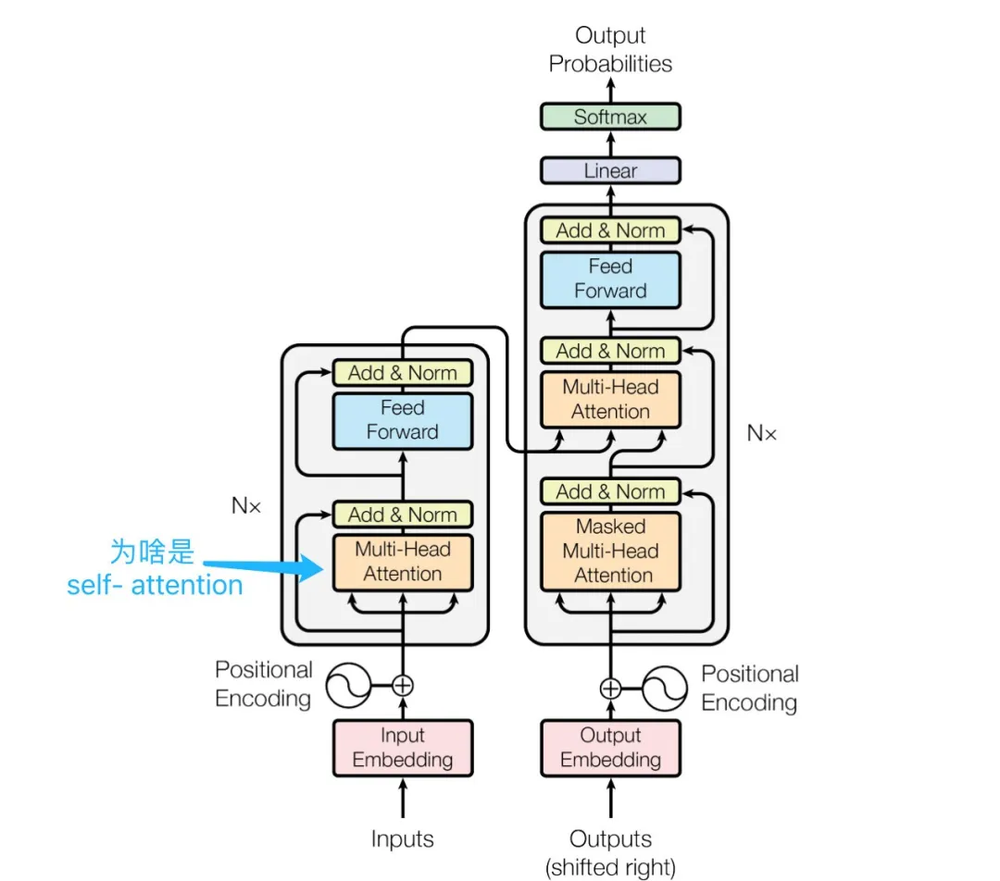

## 五大厂商大模型对比（2026年7月）

对比国内 DeepSeek、智谱(GLM)、月之暗面(Kimi)，以及 OpenAI、Anthropic(Claude) 共5家的顶尖款与常用款模型。

> 这个行业价格和榜单变化非常快（几乎每周都有新模型/调价），下表是基于各家官方文档 + Artificial Analysis Intelligence Index 榜单核实的 2026年7月数据，**用之前建议去下方文档链接核对一次**，尤其是智谱的价格官网做了前端动态渲染，没能直接抓到拆分数字，用的是第三方交叉验证的估算值。

| 公司 | 档位 | 型号 | 上下文窗口 | 最大输出 | 输入价格($/百万token) | 输出价格($/百万token) | 性能评分¹ | API 文档 |
|---|---|---|---|---|---|---|---|---|
| **DeepSeek** | 顶尖款 | DeepSeek-V4-Pro | 1M | 384K | $0.435（缓存未命中）/ $0.0036（命中） | $0.87 | AA指数 44.3（V4 Pro Max档） | [api-docs.deepseek.com](https://api-docs.deepseek.com/quick_start/pricing) |
| **DeepSeek** | 常用款 | DeepSeek-V4-Flash | 1M | 384K | $0.14（未命中）/ $0.0028（命中） | $0.28 | 未单独收录，低于Pro档 | [api-docs.deepseek.com](https://api-docs.deepseek.com/quick_start/pricing) |
| **智谱 GLM** | 顶尖款 | GLM-5 | 200K | 128K | ≈$2.7（约¥20，官网未拆分，第三方估算） | ≈$3.2 | AA指数 51.1（GLM-5.2档） | [docs.bigmodel.cn](https://docs.bigmodel.cn/cn/guide/models/text/glm-5) |
| **智谱 GLM** | 常用款 | GLM-4.6 | 200K | 128K | ≈$0.7（约¥5，第三方数据，未在官网核实拆分） | 官网未拆分 | 略低于GLM-5，具体分未查到 | [docs.bigmodel.cn](https://docs.bigmodel.cn/cn/guide/models/text/glm-4.6) |
| **月之暗面 Kimi** | 顶尖款 | Kimi K3 | 1M（1,048,576） | 262K | $3.00（缓存未命中）/ $0.30（命中） | $15.00 | AA指数 57（对标 Opus 4.8 / GPT-5.5） | [platform.kimi.ai](https://platform.kimi.ai/docs/pricing/chat-v1) |
| **月之暗面 Kimi** | 常用款 | Kimi K2.6 | 262K | 262K | $0.95（未命中）/ $0.16（命中） | $4.00 | AA指数 44 | [platform.kimi.ai](https://platform.kimi.ai/docs/pricing/chat-v1) |
| **OpenAI** | 顶尖款 | GPT-5.6 Sol | 1M | — | $5.00 | $30.00 | AA指数 58.9 | [developers.openai.com](https://developers.openai.com/api/docs/pricing) |
| **OpenAI** | 常用款 | GPT-5.6 Luna（或更常见的 GPT-5-mini） | 1M / ~400K | — | $1.00 / $0.25 | $6.00 / $2.00 | 未单独查到，低于Sol档 | [developers.openai.com](https://developers.openai.com/api/docs/pricing) |
| **Anthropic Claude** | 顶尖款 | Claude Opus 4.8 | 1M | 128K | $5.00 | $25.00 | 官方未发布单一跑分；同系 Fable 5（更贵档）AA指数59.9 | [platform.claude.com](https://platform.claude.com/docs/en/about-claude/models/overview) |
| **Anthropic Claude** | 常用款 | Claude Sonnet 5 | 1M | 128K | $3.00（活动价$2，至2026-08-31） | $15.00（活动价$10） | 定位"近Opus质量，Sonnet成本" | [platform.claude.com](https://platform.claude.com/docs/en/about-claude/models/overview) |

¹ 性能评分统一采用 [Artificial Analysis Intelligence Index](https://artificialanalysis.ai)（综合推理/代码/知识类基准的加权指数，数值越高越强），是目前少数能跨厂商横向对比的第三方榜单之一，但**它不是唯一标准**——不同基准（LMArena Chat/Code Arena、SWE-bench、MMLU等）排名会有出入，具体到"哪个模型适合你的场景"建议结合具体任务实测。部分档位（如DeepSeek-V4-Flash、GLM-4.6、GPT-5.6 Luna、Claude Opus 4.8）没有查到该榜单的独立公开评分，已如实标注，不是漏填。

