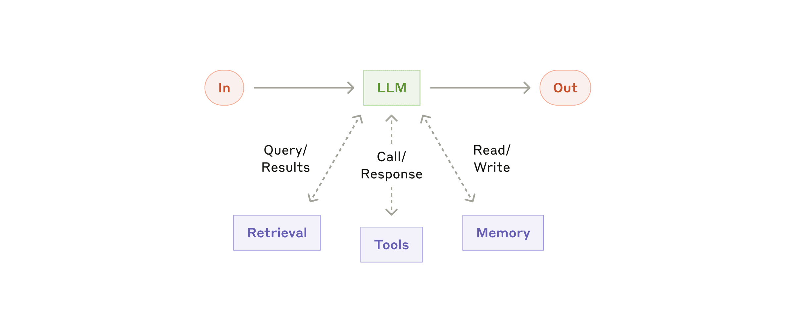
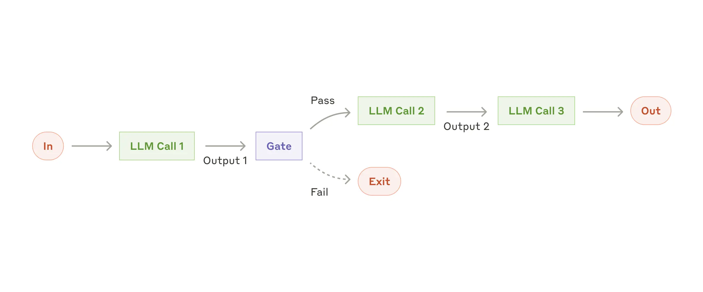
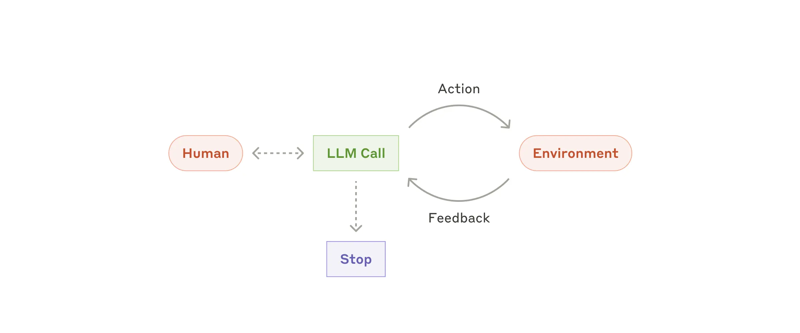
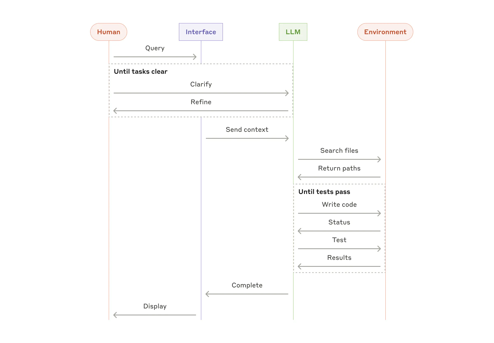

过去一年，我们和各行各业数十支团队展开合作，他们都在构建大语言模型（LLM）智能体。我们反复观察到：落地效果最好的实现方案，并没有依赖复杂框架或是专用库。相反，这些团队采用的都是简单、可组合的开发模式。
在本文中，我们将分享与客户协作以及自研智能体过程中积累的经验，同时为开发者提供构建高效智能体的实操建议。

# What are agents?
“智能体” 可以有多种定义方式。部分客户将智能体定义为能够长期独立运行的全自动系统，借助各类工具完成复杂任务。另一些客户则用该词指代遵循预设工作流、约束更强的实现方案。在Anthropic，我们将上述所有变体统称为具备智能体特性的系统，但在架构层面对工作流与智能体做出重要区分：
- 工作流是通过预设代码路径编排大语言模型与工具的系统。
- 与之相对，智能体是由大语言模型自主动态调度自身流程与工具调用、自主掌控任务完成方式的系统。
下文我们将详细探讨这两类具备智能体特性的系统。在附录一（《Agents in Practice》）中，我们介绍两类场景，客户在这些场景中使用这类系统收获了显著价值。

# When (and when not) to use agents
在基于大语言模型开发应用时，我们建议尽可能采用最简方案，仅在必要时提升系统复杂度。这或许意味着完全不必搭建具备智能体特性的系统。智能体系统往往是以牺牲延迟、增加成本为代价换取更优的任务执行效果，你需要判断这种取舍是否具备合理性。
- 当确实需要更高复杂度时，针对定义清晰的任务，工作流能够带来可预测性与稳定性；
- 当大规模场景下需要灵活性、依托模型自主决策时，智能体会是更合适的选择。
不过对于多数应用而言，结合检索与上下文示例优化单次大模型调用，通常就足以满足需求。

# When and how to use frameworks
市面上存在诸多能够简化智能体系统开发的框架，举例如下：
- The Claude Agent SDK;
- Strands Agents SDK by AWS;
- Rivet, 一款支持拖拽操作的图形化大语言模型工作流搭建工具
- Vellum, 另一款用于搭建与测试复杂工作流的图形化工具

这类框架简化了调用大语言模型、定义与解析工具、串联调用流程等常规底层工作，能够帮助开发者快速上手。但与此同时，框架常会增设额外抽象层，掩盖底层提示词与模型返回内容，提升调试难度。框架还容易诱使开发者增加不必要的复杂度，而很多场景下简易方案就足够使用。
我们建议开发者优先直接调用大语言模型接口：大量开发模式仅需少量代码即可实现。如果你选择使用框架，务必弄懂底层实现代码。对框架底层运行机制产生错误预判，是客户频繁遇到问题的一大诱因。
你可以查阅我们的代码示例库(https://platform.claude.com/cookbook/patterns-agents-basic-workflows)，参考部分实现样例。

# Building blocks, workflows, and agents
在本节中，我们将探讨在生产环境中观察到的各类智能体系统通用模式。我们将从最基础的构建单元 —— 增强型大语言模型开始，逐步提升系统复杂度，依次介绍简易可组合工作流直至自主智能体。

## Building block: The augmented LLM
智能体系统最基础的构建单元是经过增强的大语言模型，可集成检索、工具调用、记忆等增强能力。我们当前的模型能够主动运用这些能力：自主生成检索查询语句、选用合适工具，并判断需要留存哪些信息。

我们建议重点关注实现过程中的两个核心方面：根据自身具体业务场景定制这些增强能力，同时为大语言模型提供简洁完善、文档齐全的调用接口。
实现这类增强能力的方案有很多种，其中一种可以借助我们近期发布的模型上下文协议[MCP](https://www.anthropic.com/news/model‑context‑protocol)
开发者通过简单的方式即可接入持续扩张的第三方工具生态，相关教程见：https://modelcontextprotocol.io/tutorials/building‑a‑client#building‑mcp‑clients。

# Workflow

## Workflow: Prompt chaining
提示词链将一项任务拆解为一连串步骤，每一次大语言模型调用都会处理上一轮的输出结果。你可以在任意中间步骤加入程序校验逻辑（参见下方示意图中的 “关卡”），以此保障流程正常推进。

适用场景：该工作流非常适合能够清晰、规整地拆解为固定子任务的场景。核心思路是以牺牲延迟为代价换取更高准确率，将每一次大模型调用的任务难度降低。
提示词链适用示例：
- 生成营销文案，随后将文案翻译为其他语言。
- 撰写文档大纲，校验大纲是否符合指定标准，再依据大纲撰写完整文档。

## Workflow: Routing
路由机制对输入内容进行分类，并将其分发至对应的专项后续任务。该工作流能够实现关注点分离，同时构建针对性更强的提示词。倘若不采用这种工作流，针对某一类输入进行优化，可能会损害模型处理其他类型输入的效果。

适用场景：当任务较为复杂，包含多种适合分开处理的独立类别，并且能够依靠大语言模型或者传统分类模型、算法完成精准分类时，路由机制会十分适用。
路由机制适用示例：
将不同类型的客服咨询（一般性问题、退款申请、技术支持请求）分流至不同的下游流程、提示词与工具。
把简单、常见问题分配给体量更小、成本更低的模型（例如 Claude Haiku 4.5），将复杂、特殊问题交由能力更强的模型（例如 Claude Sonnet 4.5）处理，以此实现性能最优。

## Workflow: Parallelization
大语言模型有时可以同时处理同一任务，再通过程序汇总各个输出结果。这种并行处理工作流主要分为两种典型形式：
任务拆分：将一项任务拆解为多个相互独立的子任务并行执行。
多轮投票：多次运行相同任务，获取多样化的输出结果。

适用场景：当拆分后的子任务能够并行执行以提升处理速度，或是需要多方视角、多次尝试来获得可信度更高的结果时，并行处理工作流十分有效。对于需要综合多方面考量的复杂任务，如果由独立的大模型调用分别处理每一项考量点，让模型专注应对各个具体维度，大语言模型通常会表现得更好。
并行处理适用示例：
- 任务拆分：
  - 部署安全防护机制，一个模型实例处理用户提问，另一个实例同步筛查不当内容或违规请求。该方案效果通常优于单次大模型调用同时兼顾安全校验与主体回复。
  - 自动化评测大模型表现，每一次大模型调用分别评估模型在同一提示词下不同维度的表现。
- 多轮投票：
  - 核查代码漏洞，使用多组不同提示词分别审阅代码，一旦发现问题就进行标记。
  - 判断一段内容是否违规，通过多组提示词评估不同维度，并设置差异化投票阈值，平衡误判与漏判情况。

## Workflow: Orchestrator-workers
在编排器 - 工作者工作流中，由一个中心大语言模型动态拆解任务，将子任务分配给各个工作者大语言模型，并汇总整合它们返回的结果。

适用场景：该工作流非常适合无法预先确定所需子任务的复杂任务（例如代码开发场景，需要修改的文件数量、每个文件的修改内容往往取决于具体任务）。虽然它在结构上和并行处理模式相近，但核心区别在于灵活性 —— 子任务并非预先定义，而是由编排器依据具体输入动态生成。
编排器 - 工作者模式适用示例：
- 能够一次性对多个文件执行复杂修改的代码开发工具。
- 需要从多处来源搜集、分析信息，筛选潜在相关资料的检索任务。

## Workflow: Evaluator-optimizer
在评估器 - 优化器工作流中，由一轮大模型调用生成输出内容，另一轮大模型调用负责给出评估意见与反馈，二者循环执行。

适用场景：当具备清晰的评估标准，并且迭代优化能够带来可衡量的提升效果时，该工作流尤为适用。满足两项条件就很适合采用此模式：第一，人为给出反馈后，大语言模型的输出能够得到明显改善；第二，大语言模型自身有能力输出这类反馈。这类似于人类撰稿人为打磨文稿所经历的反复修改流程。
评估器 - 优化器模式适用示例：
- 文学翻译场景。翻译模型初次输出可能难以捕捉各类语言细节，而评估模型能够给出有价值的修改意见。
- 复杂检索任务，需要多轮检索与分析来收集完整信息，由评估模块判断是否有必要继续检索。

# Agents
随着大语言模型在各项核心能力上日趋成熟，智能体已开始落地生产环境：能够理解复杂输入、开展推理与规划、稳定调用工具，并且具备故障恢复能力。智能体由人类用户下达指令或通过交互对话启动工作。任务目标明确后，智能体自主规划并执行，必要时会向人类寻求更多信息或决策支持。执行过程中，智能体每一步都需要从环境中获取 “真实信息”（例如工具调用结果、代码运行输出），以此判断任务进展。智能体可以在关键节点或是遭遇阻碍时暂停运行，等待人类反馈。任务通常完成后自动结束，但一般还会设置终止条件（例如最大迭代次数），便于管控流程。
智能体能够处理复杂任务，但实现方式往往并不复杂。本质上大多只是大语言模型依据环境反馈循环调用工具。因此，清晰、周全地设计工具集及其文档至关重要。我们将在附录 2（《Prompt Engineering your Tools》）中进一步阐述工具开发的最佳实践。

适用场景：智能体适用于开放式问题，这类问题很难甚至无法预判所需执行步骤，也不能硬编码固定执行路径。大语言模型可能会进行多轮迭代，你需要在一定程度上信任它做出的决策。智能体具备自主运行特性，适合在可信环境中规模化处理任务。
智能体的自主特性意味着运行成本更高，并且存在错误持续叠加的风险。我们建议在沙箱环境中开展充分测试，并配置合理的安全防护机制。
智能体适用示例：
以下案例来自我们自身的落地实践：
- 一款代码智能体，用于解决 SWE-bench 基准测试任务，需要依据任务描述对大量文件进行修改；
- 我们推出的计算机操作演示项目[https://github.com/anthropics/anthropic-quickstarts/tree/main/computer-use-demo](https://github.com/anthropics/anthropic-quickstarts/tree/main/computer-use-demo)，由Claude操控计算机完成各类任务.

# Combining and customizing these patterns
这些基础组件并非硬性规范。它们是开发者可以灵活改造、相互组合，以适配各类业务场景的通用模式。和所有大语言模型相关功能一样，取得良好效果的关键在于持续评估性能，并迭代优化实现方案。再次强调：只有在能够切实改善最终效果时，才应当考虑增加系统复杂度。

# 总结
在大语言模型领域取得成功，不在于搭建最复杂的系统，而在于打造契合自身需求的系统。从简易提示词起步，借助全面评测持续优化；只有当简单方案无法满足需求时，再引入多步骤智能体系统。
落地智能体时，我们建议遵循三条核心原则：
- 保持智能体设计简洁。
- 保证透明度，清晰展示智能体的规划流程。
- 精心设计智能体 - 计算机交互接口（ACI），完善工具文档并充分测试。
各类框架能够帮助你快速起步，但进入生产环境后，可以适当削减抽象层级，基于基础组件进行开发。遵循以上原则构建的智能体，不仅功能强大，同时具备高可靠性、可维护性，能够赢得用户信赖。

