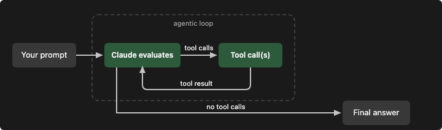

# How the agent loop works

智能体 SDK 能够将 Claude Code 的自主智能体循环嵌入到你自己的应用程序中。该 SDK 是独立软件包，支持通过代码对工具、权限、成本上限以及输出内容进行管控。

TypeScript 和 Python 版本的 SDK 均内置原生 Claude Code 二进制程序，大多数安装场景无需单独部署 Claude Code。如需额外安装，请查阅快速入门文档。

启动智能体后，SDK 会运行文档中介绍的智能体循环机制：Claude 解析提示词，调用工具执行操作，接收返回结果，持续循环直至任务完成。本文将会讲解该循环内部的运行细节，帮助你高效开发、调试与优化智能体。

# The loop at a glance

- 接收提示词。Claude 获取你的用户提示词，同时接收系统提示词、工具定义以及对话历史。SDK 会返回一条子类型为 init 的消息，其中携带会话元数据。
- 评估并生成响应。Claude 评估当前状态，决定后续执行方式。它可以返回文本、发起一次或多次工具调用，也可以两者同时输出。SDK 返回包含文本内容以及全部工具调用请求的消息。
- 执行工具。SDK 执行每一个被请求的工具并收集返回结果。每一组工具执行结果都会回传给 Claude，用于进行下一轮决策。你可以使用钩子函数，在工具调用执行前拦截、修改或者阻止工具调用。
- 循环执行。第 2 步和第 3 步循环往复。完整一轮循环记作一次交互回合。Claude 将持续调用工具、处理返回结果，直到输出不再携带工具调用的响应。
- 返回最终结果。SDK 首先返回携带文本回复（无工具调用）的最终消息，随后再返回一条消息，包含最终输出文本、token 消耗、费用与会话 ID。

一条简单提问（“这里有哪些文件？”）可能只需要一到两轮交互，调用 Glob 工具并返回结果即可完成。而复杂任务（“重构认证模块并更新测试用例”）则会在多轮交互中串联数十次工具调用，包括读取文件、编辑代码、运行测试，Claude 会依据每一轮的执行结果调整处理思路。

# Turns and messages
一次交互回合是循环内部的一次完整往返：Claude 生成包含工具调用的输出，SDK 执行这些工具，执行结果自动回传给 Claude。整个过程不会把控制权交还给你的业务代码。交互回合会不断持续，直到 Claude 输出不再携带工具调用，此时循环终止，并返回最终结果。
我们来看提示词 “修复 auth.ts 中失败的测试用例” 的完整会话流程：
首先，SDK 将你的提示词发送给 Claude，并返回一条携带会话元数据的消息。随后智能体循环正式启动：
- 回合 1：Claude 调用 Bash 执行 npm test。SDK 返回携带该工具调用的消息，执行命令后，再返回包含执行输出（3 项测试失败）的消息。
- 回合 2：Claude 调用读取工具读取 auth.ts 和 auth.test.ts 文件。SDK 返回文件内容，并返回一条助手消息。
- 回合 3：Claude 调用编辑工具修改 auth.ts，接着调用 Bash 重新运行 npm test，三项测试全部通过。SDK 返回一条助手消息。
- 最终回合：Claude 输出纯文本回复，不再附带工具调用：“已修复认证模块缺陷，三项测试现已全部通过。”SDK 返回携带该文本的最终助手消息，之后再返回一条消息，内容包含相同文本以及消耗统计与费用信息。

以上一共是四个交互回合：其中三轮带有工具调用，最后一轮为纯文本响应。
你可以通过 max_turns / maxTurns 限制循环回合数，该参数仅统计使用工具的回合。例如在上例中，如果设置 max_turns=2，程序会在执行编辑步骤之前就停止。你还可以使用 max_budget_usd / maxBudgetUsd，基于费用阈值来限制回合。
如果不设置任何限制，循环会一直运行直到 Claude 自行结束任务。对于边界清晰的任务来说这没有问题，但面对开放式提示词（比如 “优化整个代码库”）时，运行时间可能会很长。生产环境下部署智能体，建议默认配置费用上限。相关参数说明可参见下方文档https://code.claude.com/docs/en/agent-sdk/agent-loop#turns-and-budget

# Message Type
循环运行过程中，SDK 会输出一系列消息流。每条消息都带有类型标识，用于标明它来自循环的哪个执行阶段。共有五种核心消息类型：
- 系统消息（SystemMessage）：会话生命周期相关事件。通过子类型字段做进一步区分：
  ‑ init：本次运行的会话元数据。会话启动阶段执行 SessionStart 或 Setup 钩子时，对应的钩子启动消息会早于 init 消息发出。
  ‑ compact_boundary：执行自动压缩之后触发。
  ‑ informational：来自循环的纯文本状态提示。
  ‑ worker_shutting_down：主机进程退出或远程控制断开，当前回合结束后循环即将终止。
- 助手消息（AssistantMessage）：Claude 每完成一次响应后就会发出，包括最后那条纯文本响应。包含该回合产生的文本内容块以及工具调用块。
- 用户消息（UserMessage）：每完成一次工具执行后发出，携带回传给 Claude 的工具执行结果。循环中途如果有流式传入的用户输入，也会产生该消息。
- 流式事件（StreamEvent）：仅开启部分消息输出时才会产生。包含原始 API 流式事件（文本增量、工具输入分片）。
- 结果消息（ResultMessage）：标志智能体循环结束。携带最终文本结果、Token 消耗、费用与会话 ID。通过子类型字段判断任务是正常完成，还是因达到限制而终止。该消息之后仍可能收到少量后续系统事件，例如提示建议，因此需要完整遍历消息流，不要读到结果消息就直接中断。

以上五种类型完整覆盖智能体循环的全部生命周期。两个版本的 SDK 还会输出可观测性事件，例如限流状态、任务通知，这类事件并非驱动循环运行所必需。完整消息列表请查阅对应文档。

# Handle messages
需要处理哪些消息，取决于你的开发目标：
- 仅获取最终结果：处理 ResultMessage，拿到输出内容、消耗费用，以及任务是正常完成还是触发限制终止。
- 获取进度更新：处理 AssistantMessage，查看每一轮 Claude 的执行行为，包括它调用了哪些工具。
- 实时流式输出：开启分片消息（Python 为 include_partial_messages，TypeScript 为 includePartialMessages），即可实时接收 StreamEvent 消息。
判断消息类型的方式随 SDK 语言不同而有区别：
- Python：使用 isinstance()，配合从 claude_agent_sdk 导入的类做类型判断，示例：isinstance(message, ResultMessage)。
- TypeScript：读取消息的 type 字符串字段，示例：message.type === "result"。
- AssistantMessage 和 UserMessage 将原始 API 消息封装在 .message 字段内，因此内容块位于 message.message.content，而不是 message.content。

# Tool execution
工具赋予智能体执行操作的能力。如果没有工具，Claude 仅能输出文本回复。借助工具，Claude 便可以读取文件、运行命令、检索代码，以及对接各类外部服务。

## 内置工具
该 SDK 内置了驱动 Claude Code 的全套工具：
- 文件操作：Read（读取）、Edit（编辑）、Write（写入）
用于读取、修改以及创建文件。
- 搜索能力：Glob、Grep
Glob 根据匹配模式查找文件；Grep 使用正则表达式检索内容。
- 执行能力：Bash
运行 Shell 命令、脚本以及 Git 相关操作。
- 网页能力：WebSearch、WebFetch
执行网络搜索，获取并解析网页内容。
- 工具发现：ToolSearch
按需动态查找并加载工具，无需预先加载全部工具。
- 编排能力：Agent、Skill、AskUserQuestion、TaskCreate、TaskUpdate
生成子智能体、调用技能、向用户发起提问、创建与跟踪任务。
在模型可用性功能页面中，TaskCreate 和 TaskUpdate 这两个工具需要你手动开启后，Claude Code 才会提供。


除内置工具之外，你还可以：
- 通过 MCP 协议对接外部服务（数据库、浏览器、各类 API）
- 自定义实现专属工具
- 加载项目技能，复用已有的工作流逻辑

# Tool permissions
Claude 会根据任务需求决定调用哪些工具，但是工具是否真正执行由你来管控。你可以对指定工具设置自动批准、彻底禁用部分工具，或是所有工具调用都要求人工审批。共有三项配置共同决定工具的执行权限：
- allowed_tools / allowedTools：自动放行列表内的工具。例如只读智能体将 ["Read", "Glob", "Grep"] 加入允许列表，调用这些工具时无需弹窗确认。未列入该列表的工具依旧可用，但需要获取权限才能执行。
- disallowed_tools / disallowedTools：强制禁用列表中的工具，不受其他配置影响。工具执行前的规则校验顺序请查阅权限相关文档。
- permission_mode / permissionMode：用于设置人工监督的严格程度。SDK 会按照固定顺序，结合当前权限模式、允许与拒绝规则完成权限判定，可用模式参考对应文档。
你还可以对单个工具做范围限定，例如 Bash(npm *)，仅允许执行特定命令。完整的规则语法请查阅权限文档。
当工具调用被拒绝时，Claude 会收到代表拒绝的工具返回消息，通常会尝试更换实现方案，或者报告任务无法继续推进。

```text
*可以匹配全部工具，mcp__* 能够匹配所有服务端下的全部 MCP 工具。
允许规则中，只有带上字面前缀 mcp__<server>__ 之后才可以使用工具名称通配符。服务名部分不能使用通配符，规则必须指向你已经配置好的具体服务：
mcp__puppeteer__* 匹配 puppeteer 服务提供的全部工具；
mcp__github__get_* 匹配该服务下所有以 get_ 开头的工具。
```

## Parallel tool execution
当 Claude 在同一个交互回合请求多项工具调用时，两套 SDK 会根据工具类型选择并发执行或者顺序执行。只读类工具（例如 Read、Glob、Grep，以及标记为只读的 MCP 工具）可以并发运行。会修改状态的工具（例如 Edit、Write、Bash）将顺序执行，避免产生冲突。
自定义工具默认为顺序执行。如果想要让自定义工具支持并行执行，可以在工具注解中设置 readOnlyHint。TypeScript 与 Python SDK 均沿用 MCP SDK 的该字段名称。


# Control how the loop runs
你可以限制循环的最大回合数、费用上限、Claude 的推理深度，以及工具调用是否需要预先审批。以上配置项都定义在 ClaudeAgentOptions（Python）/ AgentOptions（TypeScript）中。

回合数与费用

| 配置项 | 作用 | 默认值 |
|--------|------|--------|
| 最大回合数（max_turns / maxTurns）| 工具调用的最大往返次数 | 无限制 |
| 费用上限（max_budget_usd / maxBudgetUsd）| 触发停止的最大消耗金额 | 无限制 |

当任意一项限制被触发时，SDK 返回一条 ResultMessage，携带对应的错误子类型（error_max_turns 或 error_max_budget_usd）。查看对应文档可以了解如何判断这些子类型以及具体代码写法。
费用上限会把子智能体的开销一并纳入统计：子智能体产生的消耗会计入总预算。一旦总开销触达上限，新建子智能体会失败，提示 “已达到预算限制”，同时 Claude Code 会终止仍在后台运行的子智能体。该预算管控行为要求 Claude Code 版本不低于 v2.1.217。

在流式模式与单次模式的机制下：如果某个交互回合还在运行时你发送了新消息，当该回合因达到最大回合数限制而终止后，这条新消息会保留在队列中，并独立开启新回合，同时使用属于自身的最大回合数限制。

# Effort level
effort 参数用于控制 Claude 的推理投入程度。更低的推理等级，每一轮消耗的 Token 更少，成本也更低。并非所有模型都支持该参数，支持该配置的模型列表请查阅平台文档。
这个是透传给LLM的参数，对应api入参中的```output_config.effort```

|等级	|行为	|适用场景|
|--------|------|--------|
|low	|最小化推理，响应速度快	|文件查询、目录列举|
|medium	|均衡的推理强度	|常规代码修改、标准任务|
|high	|充分分析	|代码重构、问题调试|
|xhigh	|深度扩展推理	|代码开发与智能体任务；推荐在 Fable 5、Opus 4.7 及以上版本、Sonnet 5 模型上使用|
|max	|最大推理深度	|需要深度分析的多步骤复杂问题|
如果不配置 effort，两个版本的 SDK 均不会传入该参数，直接使用模型的默认推理行为。

对于简单、边界明确的任务（例如列出文件、单次执行 grep 检索），可以调低推理等级，以此降低开销并减少响应延迟。你可以在顶层 query() 配置项中设置 effort，作用于整个会话；也可以在子智能体定义配置中单独指定 effort，覆盖会话全局的推理等级。

# Permission mode
权限模式参数（Python 中为 permission_mode，TypeScript 中为 permissionMode）用于控制智能体在调用工具前是否需要请求审批：

| 模式                                                                                                                                                                                                                                                                                                                                                                                                                                    | 	行为                                                                                                                                                                                                                                                                                                                                                                                                                  |	使用场景|
|-----------------------------------------------------------------------------------------------------------------------------------------------------------------------------------------------------------------------------------------------------------------------------------------------------------------------------------------------------------------------------------------------------------------------------------------|-----------------------------------------------------------------------------------------------------------------------------------------------------------------------------------------------------------------------------------------------------------------------------------------------------------------------------------------------------------------------------------------------------------------------|--------|
| default	                                                                                                                                                                                                                                                                                                                                                                                                                                 | 不在允许规则（allow rules）覆盖范围内的工具，会触发你的canUseTool回调函数；如果没有配置回调，则默认拒绝	                                                                                                                                                                                                                                                                                                               |带自定义审批回调的交互式应用|
| acceptEdits	                                                                                                                                                                                                                                                                                                                                                                                                                             | 自动批准文件编辑操作和常见文件系统命令（mkdir、touch、mv、cp等）；其他Bash命令仍遵循默认规则                                                                                                                                                                                                                                                                                                                          |你信任Claude的编辑结果、想要更快的迭代速度，比如做原型开发，或者在一个隔离的目录里工作|
| plan	                                                                                                                                                                                                                                                                                                                                                                                                                                    | Claude只探索和制定计划，不会真正修改你的源文件；文件编辑操作永远不会被自动批准，会通过你的canUseTool回调弹出询问                                                                                                                                                                                                                                                                                                      | 你希望Claude只提出改动方案、不真正执行，比如做代码review，或者你需要在改动被执行前先审批|
| dontAsk                                                                                                                                                                                                                                                                                                                                                                                                                                 | 从不弹窗询问。被权限规则预先批准的工具正常运行；其余全部拒绝。AskUserQuestion、被你所在组织设成"需询问"的连接器工具（connector tools），以及标记了requiresUserInteraction的MCP工具，即使你已经把它们加入允许列表，也照样会被拒绝                                                                                                                                                                                      |你希望给一个无人值守（headless）的Agent一个固定、明确的工具使用范围，比起"没配回调就默默拒绝"这种隐性行为，你更想要一个明确的硬性拒绝|
| auto                                                                                                                                                                                                                                                                                                                                                                                                                                    | 用一个模型分类器（model classifier）来自动批准或拒绝权限请求，具体可用性和行为见Auto mode文档                                                                                                                                                                                                                                                                                                                         | 想要自主运行、但仍然保留工具使用安全护栏的自治型Agent|
| bypassPermissions | 所有被允许的工具都不经询问直接运行，除了：被显式ask规则匹配到的工具、被组织设成"需询问"的连接器工具、以及需要用户交互的工具。跨session消息安全防护措施依然生效，具体优先级顺序见"权限如何被评估"那节文档。在TypeScript SDK里，还必须在options里额外设置allowDangerouslySkipPermissions: true。在Unix系统上以root身份运行时不能使用这个模式。只应该在"即使Agent做了什么也不会影响到你真正关心的系统"这种隔离环境里使用 | CI、容器，或其他隔离环境|

交互式应用应采用 default 模式，并配合工具审批回调，用以展示审批确认弹窗。
在开发设备上运行自主智能体时，使用 acceptEdits 模式：该模式会自动批准文件编辑操作与常见文件系统命令（mkdir、touch、mv、cp 等），但其余 Bash 命令依旧受允许规则的限制。
bypassPermissions（绕过权限校验）仅留给 CI、容器以及其他隔离环境使用。完整细节请查阅权限文档。


