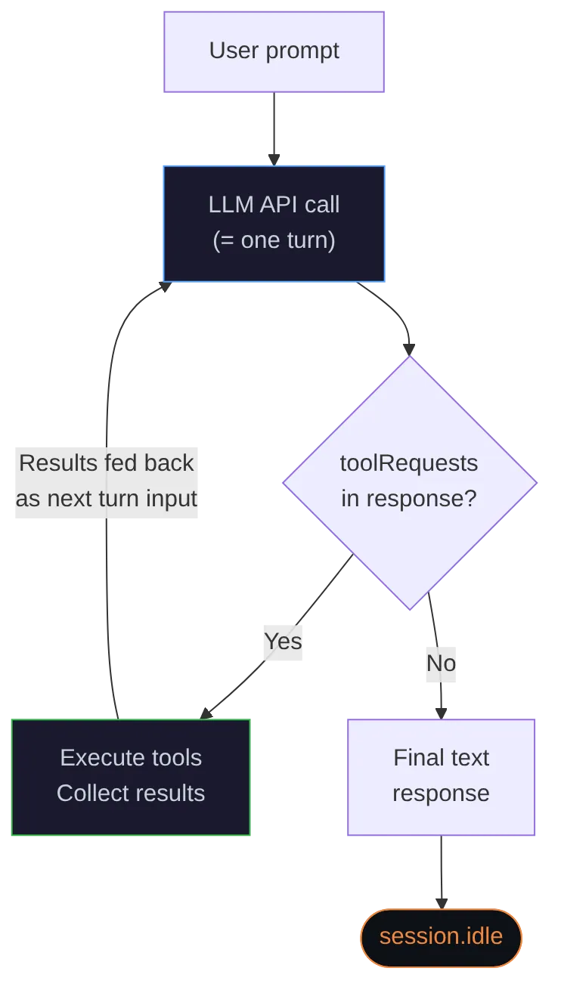
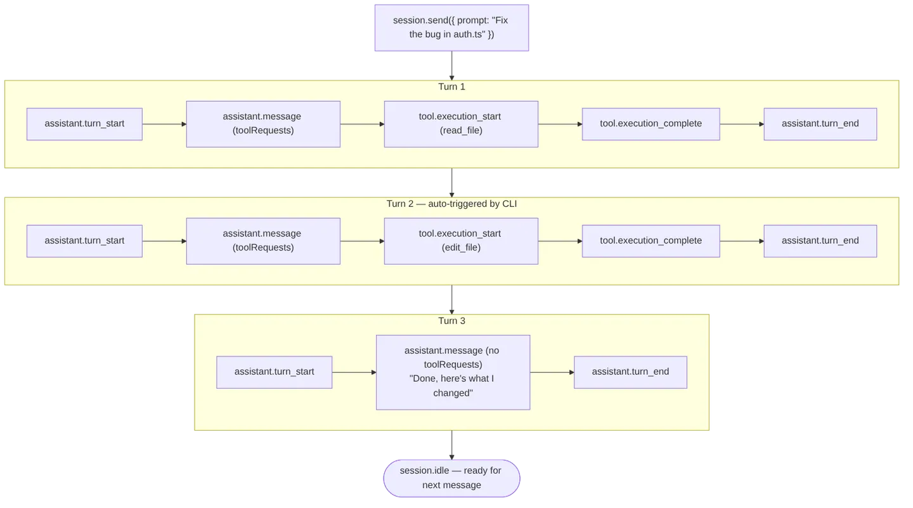

# The agent loop（Copilot智能体循环）

来源：[GitHub Docs - The agent loop](https://docs.github.com/en/copilot/how-tos/copilot-sdk/features/agent-loop)（Copilot CLI/SDK官方文档）

## 架构

**SDK**是一层传输层——它通过JSON-RPC把你的提示词发给**Copilot CLI**，并把事件回传给你的应用。**CLI**才是真正的编排者，负责运行这个"智能体工具使用循环"，不断调用LLM API，直到任务完成。

## 工具使用循环

当你调用`session.send({ prompt })`时，CLI就进入了这个循环：



模型每一次调用都能看到**完整的对话历史**——系统提示词、用户消息，以及之前所有的工具调用和工具结果。

**关键结论**："这个循环的每一次迭代，都对应**恰好一次**LLM API调用，在事件日志里表现为一对`assistant.turn_start`/`assistant.turn_end`。没有任何隐藏调用。"

## 什么是"回合"（Turn）

**一个回合（turn）**指的是**一次LLM API调用及其引发的后果**：

1. CLI把对话历史发送给LLM
2. LLM作出响应（可能带工具请求）
3. 如果请求了工具，CLI执行这些工具
4. 发出`assistant.turn_end`事件

一条用户消息，通常会引发**多个回合**。举个例子，像"这个代码库里X是怎么实现的？"这样一个问题，可能会产生：

| 回合 | 模型做了什么 | 是否有工具请求？ |
| --- | --- | --- |
| 1 | 调用`grep`和`glob`搜索代码库 | ✅ 有 |
| 2 | 根据搜索结果读取具体文件 | ✅ 有 |
| 3 | 为了获得更深的上下文，继续读取更多文件 | ✅ 有 |
| 4 | 给出最终的文本回答 | ❌ 没有 → 循环结束 |

模型在每一个回合都会自己判断：是要请求更多工具，还是直接给出最终答案。"每一次调用都能看到**完整累积的上下文**（之前所有的工具调用和结果），所以它能够据此判断自己手头的信息是否已经足够。"

## 谁来触发每一个回合？



| 角色 | 职责 |
| --- | --- |
| **你的应用** | 通过`session.send()`发出最初的提示词 |
| **Copilot CLI** | 运行整个工具使用循环——执行工具，并把结果回传给LLM进行下一回合 |
| **LLM** | 决定是要请求工具（继续循环）还是给出最终答案（停止） |
| **SDK** | 只负责透传事件；不控制循环本身 |

CLI本身是纯机械式的："模型请求了工具 → 执行 → 再次调用模型"。"**模型**才是决定什么时候该停下来的那个决策者。"

## `session.idle` 与 `session.task_complete` 的区别

这是两个不同的"完成"信号，各自的保证程度完全不一样：

### `session.idle`

* **总是会被发出**——只要工具使用循环结束，它就会触发
* **是短暂的（ephemeral）**：不会被持久化到磁盘，session恢复（resume）时也不会被重放
* 含义是："智能体已经停止处理，可以接收下一条消息了"
* **建议用它**作为你判断"完成了"的可靠信号

SDK的`sendAndWait()`方法就是在等这个事件：

```typescript
// 会一直阻塞，直到session.idle触发
const response = await session.sendAndWait({ prompt: "Fix the bug" });
```

### `session.task_complete`

* **是可选触发的**：需要模型主动、显式地发出这个信号
* **会被持久化**：会保存进磁盘上的session事件日志
* 含义是："智能体认为整个任务已经完成了"
* 可以携带一个可选的`summary`字段

```typescript
session.on("session.task_complete", (event) => {
    console.log("Task done:", event.data.summary);
});
```

### Autopilot模式：CLI会主动"催促"模型发出`task_complete`

在**autopilot模式**（无人值守/自主运行模式）下，CLI会主动追踪模型有没有调用过`task_complete`。如果工具使用循环结束了、但模型没调用这个信号，CLI会插入一条"合成的"用户消息去提醒模型：

> "你还没有用task_complete工具把这个任务标记为完成。如果你之前在做计划，现在别再计划了，开始动手实现。在你完全做完这个任务之前，不算完成。"

这实际上会**重启这个工具使用循环**——模型会把这条提醒当成一条新的用户消息，继续干活。这条提醒同时也会告诉模型**不要**过早调用`task_complete`：

* 如果还有没搞清楚的问题——先做出决定、继续干，不要调用它
* 如果遇到了报错——先想办法解决，不要调用它
* 如果还有剩余步骤没做完——先做完，再调用它

这在autopilot模式下形成了一套**两层的完成机制**：

1. 模型主动调用`task_complete`并附上摘要 → CLI发出`session.task_complete` → 完成
2. 模型没调用就停下来了 → CLI发出提醒 → 模型要么继续干，要么这时候才调用`task_complete`

### 为什么`task_complete`有时候不会出现

在**交互模式**（普通聊天场景）下，CLI不会去"催促"模型调用`task_complete`，模型完全可能压根不调用它。常见原因有：

* **纯问答场景**：模型回答完问题就直接停了——压根不存在一个明确的"任务"需要被标记完成
* **模型自主判断**：模型直接给出最终文本回复，没有调用这个"任务完成"信号
* **会话被中断**：session在模型走到"完成"这个节点之前就结束了

**不管上面哪种情况，CLI都照样会发出`session.idle`**，因为这是一个**机械层面**的信号（循环结束了），不是一个**语义层面**的信号（模型自己觉得任务做完了）——这两者是完全独立的两码事。

### 该用哪个信号？

| 使用场景 | 该用的信号 |
| --- | --- |
| "等智能体处理完" | `session.idle` ✅ |
| "想知道一个编码任务什么时候真正完成" | `session.task_complete`（尽力而为，不保证一定有） |
| "超时/错误处理" | `session.idle` + `session.error` ✅ |

## 统计LLM调用次数

事件日志里`assistant.turn_start`/`assistant.turn_end`这一对事件出现的次数，就等于这次会话总共发起的LLM API调用次数。"不存在任何用来做规划、评估或者完成度检查的隐藏调用。"

查看一个session的回合数：

```bash
# 统计一个session事件日志里的回合数
grep -c "assistant.turn_start" ~/.copilot/session-state/<sessionId>/events.jsonl
```

## 学习笔记：跟Claude Code文档的对照

1. **"回合"的定义方式和Claude Code文档几乎一模一样**——"一次回合 = 一次LLM API调用 + 它引发的后果"，两家的说法逐字对得上，说明这是行业收敛的共识定义，不是Copilot自己独创的概念。
2. **`session.idle` vs `session.task_complete`这组区分，是Claude Code文档里没有的新内容**——这是"循环机械性地停了"（`idle`）和"模型主观认为任务做完了"（`task_complete`）两个完全独立的信号，精确回答了一个容易被忽略的问题：**Loop停下来，不代表任务真的完成了**，这两者要分开判断。
3. **Autopilot模式的"催促"机制（nudge）也是新东西**——模型没主动喊"完成"，CLI会伪造一条用户消息去怼它继续干活，这是一个针对"无人值守场景"的具体工程手段，Claude Code文档里没提过。
