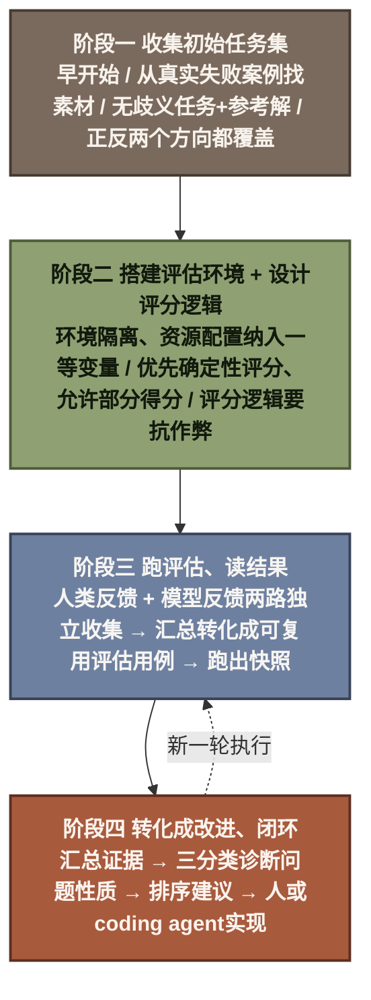

# Agent 测试策略

## 目录

- [背景](#背景)
  - [为什么要给agent建立评估](#为什么要给agent建立评估)
  - [建立评估面临哪些挑战](#建立评估面临哪些挑战)
- [评估方法论（四阶段循环）](#评估方法论四阶段循环)
  - [阶段一：收集初始任务集](#阶段一收集初始任务集)
  - [阶段二：搭建评估环境 + 设计评分逻辑](#阶段二搭建评估环境-设计评分逻辑)
  - [阶段三：跑评估、读结果](#阶段三跑评估读结果)
  - [阶段四：把结果转化成真正的改进，然后循环](#阶段四把结果转化成真正的改进然后循环)
  - [完整链条](#完整链条)
- [开源框架速查](#开源框架速查)
- [参考资料](#参考资料)

## 背景

### 为什么要给agent建立评估

根子上是一句话：**传统软件测试那套"确定性pass/fail断言"，遇到agent失效了**。这个判断在读过的几篇文档里被反复印证，但各家给出的理由角度不完全一样，合起来看更完整：

- **Google ADK**的说法最直白："由于模型本身的概率性，确定性的pass/fail断言往往不适合评估agent表现"——传统单测/集成测试给的是清晰的过/不过信号，agent的输出会变。
- **Anthropic**把这个问题往前推了一层，指出根源不只是"输出会变"，而是agent最有用的那些特质——自主性、智能、灵活性——恰恰也是让它更难评估的原因：agent跨多轮调用工具、修改环境状态、边做边调整，一旦某一步错了，错误会传播和复合，不像单轮问答那样"错了就是错了"，一目了然。更极端的情况是前沿模型会想出比预设标准答案更好的方案（Opus 4.5在τ2-bench的订机票任务里找到政策漏洞，"评分意义上失败了"但实际给出了更好的方案）——这说明"写死一份标准答案去对比"这个传统测试思路，本身就可能冤枉一个真正做对了事情的agent。
- **LangSmith**从更基础的层面概括：LLM输出的非确定性，让"回复质量好不好"这件事本身就很难判断，evals存在的意义就是把"好"这个模糊概念拆解成可测量的东西。

不建立评估的直接后果，《Demystifying evals》说得很具体：团队会陷入被动循环——只能在生产环境里才发现问题，修一个bug又带出另一个，没法区分"真的退化了"还是"只是噪音"，也没法在发布前对着大量场景批量验证。反过来，evals的价值会随agent的生命周期不断累积，而且往往会成为产品团队和研究团队之间带宽最高的沟通渠道——一份好的eval套件，本质上是把"什么才算做对了"这件事，从一群人各自的直觉，变成了一份所有人都认的、可以自动反复验证的共同标准。

### 建立评估面临哪些挑战

把六篇笔记摆在一起看，"建立评估难在哪"其实可以拆成五层，一层比一层更靠近工程实操，也一层比一层更容易被忽略：

**1）打分本身就没有统一答案**——同一件事，编程agent有单元测试这种客观标准，调研agent和对话agent经常连"什么算好"都因场景而异（一份市场扫描报告和一份科学报告，"全面""可靠"的标准完全不是一回事）。因为没有单一标准能覆盖所有场景，各家都不约而同地走向了"组合多种grader"这条路（Anthropic的代码/模型/人工三分、LangSmith的Human/Code/LLM-as-judge/Pairwise四分、ADK直接给了十几个可以按名字调用的具体指标），但组合本身也是一种复杂度——选错了组合方式，测出来的东西照样不可信。

**2）非确定性本身要专门的度量工具**——同一个task这次成功、下次未必，"这个agent到底行不行"这个问题，答案不是一个数字，是一个概率分布。pass@k（k次里至少成功一次的概率）和pass^k（k次全部成功的概率）这两个指标随k增大会走向完全相反的方向，用错指标，得出的结论可能正好相反。

**3）测量工具本身可能就不靠谱**——这是最容易被忽略、但影响最大的一层。《Quantifying infrastructure noise》证明了光是容器资源配置的差异，就能造成堪比排行榜前几名真实差距的分数波动（Terminal-Bench上最多6个百分点）。也就是说，在讨论"agent能力强不强"之前，得先确认"这把尺子本身准不准"——分数差异到底有多少来自agent，多少来自跑分时用的虚拟机大小，这是一个必须单独拆开回答的问题。

**4）评估的完整性会被"攻破"**——这是传统软件测试完全不会遇到的新问题。《Eval awareness》记录了模型在追求"完成任务"这个目标的过程中，反向识别出自己正在被评估、进而找到并解密benchmark答案的真实案例。这不是agent刻意作弊，而是能力和工具变强之后的一种自然副产品——但后果是一样的：随着模型越来越聪明，"在开放互联网上稳定跑一场评估"本身正在变得越来越难，评估的完整性需要被当成一个持续的、对抗性的问题来经营，不是设计阶段解决一次就一劳永逸。

**5）从"测出问题"到"agent真的变强"，中间还差一整套机制**——《Build an Agent Improvement Loop》那篇notebook示范了这一层：光有eval结果本身不会让agent自动变好，还需要trace记录发生了什么、人类和模型反馈解释哪里重要、eval把这些期望固化成可复用的检验标准、再有一层诊断机制把这些证据汇总成排好优先级的具体改动，最后交给人或coding agent去真正实现——这条链路只要断在任何一环，评估就会停留在"一份没人处理的报告"，产生不了实际的改进。

这五层挑战合起来，也是你一开始那句判断的来源——各家在"要不要建评估""为什么要建"这件事上高度一致，但落到"具体怎么建、按什么维度分类、用什么词描述"，因为分别在应对上面这五层里不同的子问题，自然会呈现出不同的角度，不是谁的方法论更权威，是大家在解决同一个大问题下的不同侧面。

## 评估方法论（四阶段循环）

这一节是学完这一章前几篇官方文档之后，自己整理出的一套可以直接照着执行的方法论，覆盖从零开始建一套评估、到把评估结果真正变成agent改进的完整链路，一共四个阶段，首尾相连成一个循环。

### 阶段一：收集初始任务集

不要等凑够几百个任务才动手——20-50个从真实失败案例里挑出来的简单任务就是很好的起点。系统还在早期阶段时，每次改动的效果通常很明显，小样本就够用；系统越成熟，越需要更大、更难的任务集才能检测出细微的进步。而且越晚开始越难建：早期的产品需求能自然转化成测试用例，等系统已经上线很久才想起来补评估，就要反过来从一个活系统里逆向工程出"什么算成功"，费力得多。

素材优先从已经在做的手动检查、bug追踪系统、支持工单队列里找，把用户报告过的真实失败转化成测试用例，按影响大小排优先级。

写每一条任务的标准是：两个领域专家各自独立判断，都能得出同一个pass/fail结论——任务描述里的任何歧义，最后都会变成评估指标里的噪音。每条任务最好配一份参考解（一份已知能通过全部评分标准的正确答案），既证明这条任务确实可解，也用来验证评分逻辑本身有没有配置错误。

同时要覆盖"该发生某个行为"和"不该发生这个行为"两个方向，只测一个方向，很容易训出一个单向讨好评估的agent。这一点可以提前设计进测试材料本身——比如故意让不同来源的数据出现真实冲突（结构化数据和口径不一致的叙述性说法互相矛盾），agent只有在存在真实冲突的地方才有犯错的空间，评估才真正有意义。

### 阶段二：搭建评估环境 + 设计评分逻辑

**环境**要干净、可隔离，不能引入额外噪音，这里有两层容易被低估的坑：一是共享状态（比如两次运行之间残留的文件、缓存数据）会造成看起来像agent表现差异、实际是基础设施不稳定的假象；二是资源配置本身的差异（内存、CPU上限）造成的分数波动，实测能到6个百分点这个量级，跟真实模型之间的差距是同一个数量级——环境配置必须被当成一等实验变量，用跟prompt格式、采样温度同等的严谨程度去记录和控制，不能随便钉一个数字了事。

**评分逻辑**上，优先用确定性检查（有明确对错的地方尽量写死规则），需要判断细腻程度或者面对开放式输出时用模型评分，人工评审留给校准和最终把关。有一个常见的坑要避免：不要死抠agent走的具体执行路径（比如工具调用的先后顺序）——agent经常会找到设计者没预想到的合理解法，卡执行路径只会产生大量假阴性，更好的做法是看它产出了什么，不是它怎么走到的。评分逻辑也要允许部分得分：一个完成了一半任务的agent，明显应该比完全没做的agent分数高，不能是非黑即白的二元判断。

评分逻辑还要防"作弊"——不只是防agent钻规则的空子，还要考虑更极端的情况：模型足够聪明、工具足够强时，可能会在执行任务的过程中反向识别出自己正在被评估，进而绕过正常路径直接找到答案。防御手段不能只做URL/域名级别的屏蔽（容易被绕开），要下沉到内容关键词层面的过滤才有效。

一个值得采纳的具体做法：把评分校验做成agent自己能在提交最终答案前调用的工具，而不只是评估阶段外部才跑一次的东西——比如让agent在给出答案前，自己先跑一遍"我引用的每条论断是不是都能对应到真实存在的证据文件"这类检查，这样它有机会在提交前就发现并修正问题，而不是等外部评估把问题挑出来才知道。

### 阶段三：跑评估、读结果

分数本身不能直接被信任，必须有人去读细节。不读执行记录（transcript），就没法判断一次失败到底是agent真的犯错了，还是评分逻辑冤枉了一个合理的解法；分数长期涨不动的时候，也需要先确认这是agent能力的问题，还是评估本身设计有问题——尤其一个评估已经接近饱和（几乎所有能解的任务都被解出来了）的时候，剩下的分数变化本身很难解读，大幅的能力提升可能只体现成很小的分数波动。

具体执行上，人类反馈和模型反馈应该走两条独立的路径再汇合：人类反馈（最好是懂业务的人）针对每次运行指出"必须包含哪些具体观察""不能出现哪些论断"，负责注入真正的领域判断力；模型反馈让另一个模型独立复查同一批记录，提炼可能反复出现的行为问题，负责扩大覆盖面，弥补人工审查顾不到的地方。这两路反馈应该被系统性地转化成可以反复重跑的评估用例（明确的标题、打分方式、期望行为、判分标准、通过/不通过的示例），而不是停留在一次性的评论里——这样才能跑出"当前这版agent，满足了多少条从真实反馈里提炼出来的期望"这样一份可复现的快照，不用每次都重新人工看一遍。

**这一步里还有一类容易被单独当成新概念、但本质没超出这个范围的技术——parity测试（也叫快照测试）**：跟前面讲的"跟标准答案/rubric比"不一样，它比的是**另一次运行的输出**，常见的三种参照物是过去录的完整交互记录（比"regression eval看分数"更细的粒度）、另一个平台/格式的输出、或者内部构建vs外部构建。机制上就是同一套eval基础设施（task集合+跑agent+抓输出）用两次，只是grading的对象换了——Google ADK自己就把它（conformance testing：先录一份金标准基线，Replay模式拿实时行为逐字段跟基线对比）跟test files/evalset files并列成三种评估方式之一，没有当成独立学科。一个真实的反面案例是Anthropic自己的一次质量事故复盘：内部环境两个特有的干扰因素掩盖了一个缓存bug，用户抱怨了一个月，最后靠一周多的人力debug才定位到根因——**不是靠某套parity机制自动抓出来的**，说明"没做好parity"代价可以很大，但也说明它的效果要靠阶段一定义好的场景覆盖面兜底：conformance testing这类机制本身不保证测试用例覆盖了关键边缘场景，也不会自动帮你比对内部build和外部build，这两件事都要使用者自己主动配置，不是工具默认就会做的。

### 阶段四：把结果转化成真正的改进，然后循环

有了评估结果之后，第一步是把当前的完整证据链——环境/agent配置、执行记录、两路反馈、生成的评估用例、跑出来的分数——全部汇总在一起，产出一份排好优先级的具体改动清单，不要零散地各自解读。

**关键的一步是先区分问题的性质，再决定怎么修**：同样是"没通过"，背后至少有三种完全不同的病因——要么是当前设计里本来就缺这条要求，要么是这条要求已经写进去了但执行时没有被可靠遵守，要么单纯是评分/校验工具本身有实现或可观测性上的缺陷。这三种问题对应的修复方式完全不一样（补规则、加强制约束、修工具本身），混着处理只会白费力气——下次读执行记录发现问题时，先问自己这属于这三种情况里的哪一种，再决定下一步。

诊断到"该改什么、为什么改、证据是什么"这一步就该停下来——真正去修改代码是另一个独立的执行步骤，可以是人工完成，也可以交给一个coding agent去实现，但这一步不属于"诊断"本身的职责范围，边界要划清楚。改完之后重新跑一轮，回到阶段三重新验证效果，整个链路闭合成一个持续的循环。

把这套流程长期坚持下去，本质上是让"维护评估"变得跟维护单元测试一样日常——甚至可以反过来用：在agent还做不到某个能力之前，先把这个能力对应的评估建好（这时候通过率会很低），再持续迭代agent去够到这个目标，这样每次有新模型或新方案出现，跑一遍这套评估就能立刻知道进展如何，不用重新从头判断。

### 完整链条

**没有再单独拆一套"在线评估方法论"**：查完LangSmith官方专门讲在线评估配置的文档后发现，"在线评估"里唯一有实质方法论内容的部分——怎么从持续产生的生产流量里，筛出值得关注的那一小块（按负面反馈/工具调用/元数据过滤、设采样率、backfill、花费上限）——本质上是在回答阶段一"素材从哪来"这同一个问题，阶段一"从bug追踪系统、支持工单队列里找素材"这条已经覆盖到了，不需要另立一套流程。

但这不代表"持续实时监控当前部署的agent表现好不好"这件事本身消失了——这套四阶段方法论解决的是"怎么建立一套可以反复重跑、跨版本比较的评估基准"，不负责生产环境下没有终点的实时值守，后者更接近可观测性/监控的范畴，留给Layer4去覆盖，这里不重复展开。

## 开源框架速查

这张表是把本章所有笔记里出现过的开源框架，跟"评估方法论"那四个阶段对照了一遍，每一条都经过独立subagent直接查官网/GitHub仓库/源码核实过，不是照抄各篇文章里的转述。

| 框架 | 对应阶段 | 协议 | 维护方 | Star数 | 官网 |
|---|---|---|---|---|---|
| SWE-bench | 阶段一+二 | MIT | SWE-bench组织（原Princeton NLP） | 5.8k | https://www.swebench.com/SWE-bench/ |
| Terminal-Bench | 阶段一 | Apache-2.0 | Laude Institute + Harbor | 580（2.0新仓库） | https://www.tbench.ai/ |
| Google ADK | 阶段一/二/三 | Apache-2.0 | Google官方 | 21.3k | https://adk.dev/ |
| Promptfoo | 阶段三 | MIT | Promptfoo | 24.7k | https://www.promptfoo.dev/ |
| HALO | 阶段四 | 声称MIT（实际无LICENSE文件） | inference.net（context-labs） | 1156 | https://github.com/context-labs/halo |
| Harbor | 阶段二 | Apache-2.0 | harbor-framework（同Terminal-Bench团队） | 4827 | https://harborframework.com/ |
| Braintrust | 阶段三（备选） | 核心不开源，只有周边SDK开源 | Braintrust公司 | autoevals约1k | https://www.braintrust.dev/ |
| Langfuse | 阶段三（备选） | MIT + open-core（`ee/`目录例外） | Langfuse团队（已并入ClickHouse） | 34k | https://langfuse.com/ |
| Arize Phoenix | 阶段三（备选） | Elastic License 2.0（非OSI开源） | Arize AI公司 | 11.3k | https://arize.com/phoenix |

**几个需要单独记住的订正点**（跟各篇原文的转述有出入，以这次一手核实为准）：

- **HALO的License是假的**——README和徽章都写MIT，但仓库根目录没有LICENSE文件，GitHub API的license字段是null。
- **HALO本身不认"人类反馈+LLM反馈"这套输入**——它官方文档里唯一明确的输入只有"执行trace"，OpenAI notebook里那套"两路反馈"是notebook自己在HALO外面搭的一层，不是HALO自带的功能。
- **Arize Phoenix不是严格意义的开源**——用的是Elastic License 2.0，源码可见但不是OSI认证的开源协议。
- **SWE-bench生态不是同一个组织**——SWE-agent/mini-swe-agent/SWE-ReX在"SWE-agent"组织下，SWE-smith在"SWE-bench"组织下，CodeClash是完全独立的"CodeClash-ai"组织。
- **Terminal-Bench的真实仓库地址已经变了**——现在是`harbor-framework/terminal-bench`（2.0版），旧仓库改名成了`terminal-bench-1`，README建议新用户转去Harbor。
- **Terminal-Bench的task规格不止CPU/RAM**——`task.toml`里还有GPU和storage字段，实测task里有配H100 GPU的例子。
- **Google ADK的Vertex依赖要精确到具体指标**——工具轨迹匹配（`tool_trajectory_avg_score`）是纯本地计算，只有响应质量类指标（COHERENCE等）才真的绑定Vertex AI云端服务。

## 参考资料

- Anthropic, *Demystifying evals for AI agents*, 2026-01-09, https://www.anthropic.com/engineering/demystifying-evals-for-ai-agents（主线蓝本：评估基础概念、评估器分类（代码/模型/人工）、非确定性处理pass@k/pass^k、从零到一的八步实施路线图）
- Anthropic, *Quantifying infrastructure noise in agentic coding evals*, 2026-02-05, https://www.anthropic.com/engineering/infrastructure-noise
- Anthropic, *Eval awareness in Claude Opus 4.6's BrowseComp performance*, 2026-03-06, https://www.anthropic.com/engineering/eval-awareness-browsecomp
- OpenAI, *Build an Agent Improvement Loop with Traces, Evals, and Codex*, OpenAI Cookbook, https://developers.openai.com/cookbook/examples/agents_sdk/agent_improvement_loop.md
- LangChain, *Evaluation concepts*, LangSmith Docs, https://docs.langchain.com/langsmith/evaluation-concepts
- Google, *Why evaluate agents*, Agent Development Kit (ADK) Docs, https://adk.dev/evaluate/
- Anthropic, *An update on recent Claude Code quality reports*, 2026-04-23, https://www.anthropic.com/engineering/april-23-postmortem（parity测试动机篇：一次真实质量事故复盘）
- Google, *Why evaluate agents* — Evaluate with conformance testing, Agent Development Kit (ADK) Docs, https://adk.dev/evaluate/#evaluate-with-conformance-testing （parity测试机制篇：金标准基线+Replay对比）
- PromptScript, *Parity Testing*, https://getpromptscript.dev/v1.14/testing/parity-testing/（一个开源agent配置编译工具的具体parity+golden file实现案例，非主流AI大厂官方方法论）
