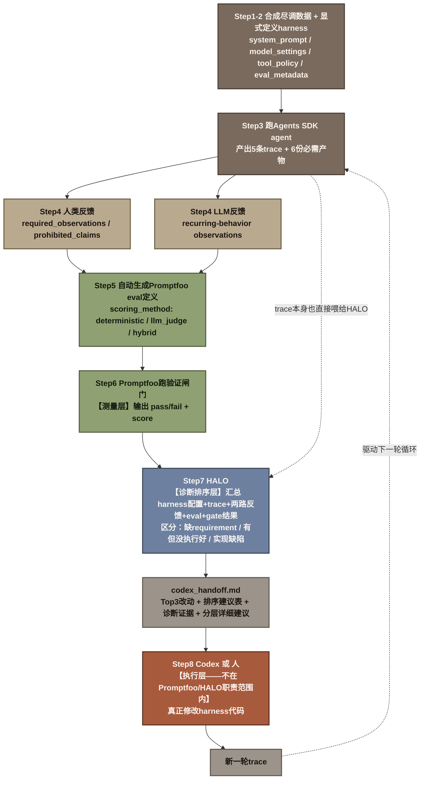

# Build an Agent Improvement Loop with Traces, Evals, and Codex 学习笔记

来源：OpenAI Cookbook，一篇可运行的Jupyter notebook，地址 https://developers.openai.com/cookbook/examples/agents_sdk/agent_improvement_loop.md 。**发布日期没能确认**——抓取到的页面头显示的时间戳跟当天日期完全一致，大概率只是Cookbook页面动态渲染/最近编辑的时间戳，不是这篇内容原始发布的日期，不能当作可靠的发布时间引用。

本笔记不逐段贴代码（notebook里大段是Python实现细节），是转述整体架构、每一步在解决什么问题、以及跟本章其他笔记的对应关系。

## 目录

- [1 要解决的问题：一个闭环的"agent改进飞轮"](#1-要解决的问题一个闭环的agent改进飞轮)
- [2 案例背景：虚构的并购尽调agent](#2-案例背景虚构的并购尽调agent)
- [3 第一步：把harness显式定义成一份schema](#3-第一步把harness显式定义成一份schema)
- [4 第二步：跑出真实trace](#4-第二步跑出真实trace)
- [5 第三步：收集人类反馈和LLM反馈](#5-第三步收集人类反馈和llm反馈)
- [6 第四步：把反馈变成可复用的Promptfoo evals](#6-第四步把反馈变成可复用的promptfoo-evals)
- [7 第五步：用Promptfoo跑一次验证闸门](#7-第五步用promptfoo跑一次验证闸门)
- [8 第六步：HALO——把全部证据汇总成排序过的改进建议](#8-第六步halo把全部证据汇总成排序过的改进建议)
- [9 第七步：把报告交给Codex去实现](#9-第七步把报告交给codex去实现)
- [10 闭环：两种运行模式](#10-闭环两种运行模式)
- [11 完整链条图解：从trace到harness改动](#11-完整链条图解从trace到harness改动)
- [12 值得记的点](#12-值得记的点)

## 1 要解决的问题：一个闭环的"agent改进飞轮"

这篇notebook要做的事情，原文一句话概括：

> We start with real traces, add human and model feedback, turn that feedback into evals, and use the resulting evidence to propose the next harness changes for Codex to implement.

翻译：从真实trace出发，加上人类反馈和模型反馈，把这些反馈转成evals，再用这些证据去提出下一版harness该怎么改，交给Codex去实现。**这跟本章其他几篇讨论"怎么评估agent"不同，这篇讨论的是"评估结果之后怎么办"**——评估不是终点，是驱动harness持续改进这个循环的燃料。

文中给出了这篇文章自己对harness的定义：

> In this notebook, the **harness** is the full contract around the model, including instructions, tools, routing, output requirements, and validation checks.

**这是目前查到的第N个harness定义**，跟Anthropic 4月那篇"the loop, tools, context management, and guardrails"、以及《Demystifying evals》里"the system that enables a model to act as an agent: it processes inputs, orchestrates tool calls, and returns results"结构上是同一类——都是在列举"model周围那圈契约"具体由哪些部分构成，只是各家列的具体成分略有不同（这篇强调"instructions、tools、routing、output requirements、validation checks"，多了"output requirements"和"validation checks"这两项，跟这篇文章本身是"尽调agent要产出结构化审计物料"这个场景强相关）。

## 2 案例背景：虚构的并购尽调agent

示例agent做的是一项虚构公司的并购尽调（acquisition diligence）工作：读取财务报表、客户数据、合同、安全资质、董事会材料、管理层叙述，然后带引用地回答尽调问题。

这批合成数据故意设计成**结构化数据和叙述性文档会互相冲突**——比如董事会材料报的FY2025 ARR是4300万美元，但财务口径的ARR bridge只有3690万美元（差异来自尚未生效的签约承诺和不算经常性收入的usage true-up）；销售FAQ说"SOC 2 complete"，但真实情况是Type I做完了、Type II还在进行中；客户集中度按法律实体算和按母公司口径合并算差异很大（Northstar Bank和Northstar Capital Markets合并算成Northstar Holdings之后，集中度明显更高）。**这套"数据源之间互相打架"的设计是故意的**——只有存在这种冲突，agent才有真正会犯错的空间，评估和改进才有意义。

## 3 第一步：把harness显式定义成一份schema

跟很多只把harness当成"一段prompt文字"的做法不同，这篇文章把harness显式拆成了几块结构化的东西：`system_prompt`（证据使用规则、结构化数据优先于叙述性数据、遇到冲突要显式说明不能悄悄调和）、`model_settings`（用哪个模型、reasoning effort档位）、`tool_policy`（能读写哪些目录、必须产出哪些artifact、运行时能用哪两个校验脚本）、`eval_metadata`（当前这个harness版本号、是不是"已提升为正式版本"）。

**两个运行时校验工具**是这个harness设计里比较值得记的部分：一个叫`check_evidence_coverage.py`，在agent给出最终答案前，检查它草拟的每条重要论断有没有引用真实存在的数据文件；另一个叫`validate_output_contract.py`，检查agent写出来的六份必需产物（摘要、投资备忘录、结构化风险清单、未解决问题清单、引用清单、证据表）是否齐全、格式对不对、引用的文件是否真实存在。**这两个工具本身就是Agent Testing Strategy和Tool Design两章的交叉点**——它们既是agent运行时自我校验的工具，又直接对应《Demystifying evals》里"code-based grader"这一类打分器的思路，只是这里不是在评估阶段跑一次，而是被写进了harness本身，让agent在给出答案之前先自己跑一遍。

## 4 第二步：跑出真实trace

用五个不同角度的尽调问题（融资风险、收入质量、客户集中度、安全就绪度、哪些指标该拒绝推断）分别跑一次agent，每次运行都会写出一份完整的trace，加上harness要求的六份产物。

Trace的导出方式值得一提：notebook自己写了一个导出器，把OpenAI Agents SDK内部的span（agent/generation/function调用/handoff/guardrail等不同类型）逐条翻译成OpenTelemetry风格的JSONL格式——**这是Layer4可观测性里OTel概念在agent测试场景下的一次具体落地**，虽然你目前暂时跳过了Layer4，但这里可以先留个印象：trace/span这套词汇体系，在评估agent的场景下和在生产可观测性场景下是同一套东西，只是消费方不一样（这里是喂给下面第6步的HALO，不是喂给监控大盘）。

## 5 第三步：收集人类反馈和LLM反馈

这一步刻意让**人类反馈**和**模型反馈**走两条独立的路径，不混在一起：

**人类反馈**（notebook里用手写的mock数据模拟一位真实评审——真实场景里应该是懂业务的财务负责人）：针对每条trace，指出"必须包含哪些具体观察"（比如"必须明确点出11个月的跑道"）和"不能出现哪些论断"（比如"不能暗示公司有超过12个月的跑道"）。

**LLM反馈**：让另一个模型去看同一批trace，独立提炼出"可能反复出现的行为观察"，供后续生成eval时参考，作用是补充覆盖面。

原文强调这两条路径的分工：

> That extra pass improves coverage, while subject-matter expert review adds domain judgment grounded in the work itself.

翻译：模型这条路径负责扩大覆盖面，人类专家评审负责注入真正的领域判断力——**这正好呼应《Demystifying evals》里"三类grader各有分工"那条经验，只是这里分工的不是打分器，是反馈来源本身**。

## 6 第四步：把反馈变成可复用的Promptfoo evals

这一步是整个流程里最关键的转化环节：让一个模型综合trace、人类反馈、LLM反馈，自动生成一批**Promptfoo**（一个开源的LLM应用评估/红队测试CLI工具）格式的eval定义。每条eval包含标题、打分方式（`deterministic`确定性/`llm_judge`模型判分/`hybrid`两者结合）、期望行为描述、一段供LLM rubric判分用的评分标准、可选的字面断言（比如"包含/不包含某个关键词"）、以及一组示例性的"通过样例"和"不通过样例"。

原文特别提醒这一步不该完全自动化：

> Evals are a good place to invest manual effort from subject-matter experts and developers. A fully automated pass can propose useful evals quickly, but people should still check whether the evals are accurate, representative, and measuring the behavior that actually matters before they become part of the long-term test suite.

翻译：自动生成的eval可以快速给出草稿，但人还是应该检查这些eval是不是准确、有代表性、测的是真正重要的行为，之后才应该把它们并入长期使用的测试套件——**这正是《Demystifying evals》Step 5"设计graders"那条经验的具体落地场景**：自动化能提高效率，但grader质量的把关这一步不能省。

## 7 第五步：用Promptfoo跑一次验证闸门

把上一步生成的eval定义，喂给Promptfoo实际跑一遍，针对现有的trace输出打分——这一步的作用是给出"当前这版harness的行为，究竟满足了多少条从反馈里提炼出来的期望"这样一份快照。原文示例里跑出来的结果是5条eval全部通过。

值得注意的是这一步的机制设计：Promptfoo这次评的是**已经跑出来的trace**（现成答案），而不是重新驱动agent去回答；如果要验证"下一版harness改了之后表现怎么样"，需要把Promptfoo的provider换成一个真正调用候选agent的接口，重新跑一遍同一套eval——这是同一套eval套件能被反复复用、驱动持续迭代的关键设计。

## 8 第六步：HALO——把全部证据汇总成排序过的改进建议

**HALO**（Hierarchical Agent Loop Optimization，分层agent循环优化）是一个独立的开源方法论+Python包（[context-labs/halo](https://github.com/context-labs/halo)），专门用来"从执行trace出发改进agent harness"。原文描述它的工作方式：

> HALO reviews the current harness together with the agent traces, human feedback, model feedback, generated evals, and Promptfoo results. It then produces a ranked set of changes for the next implementation pass.

翻译：HALO会把当前的harness配置、agent的执行trace、人类反馈、模型反馈、生成的eval定义、以及Promptfoo的打分结果，全部汇总在一起通盘分析，产出一份排好优先级的改动清单。

它输出的报告有固定的结构（这篇notebook自己在prompt里明确规定了这个结构）：执行摘要→最值得优先做的三项改动→带影响度/置信度/实现难度的排序建议表→支撑诊断证据（会区分"harness里本来就缺这条要求"vs"harness里有这条要求但执行时没被可靠遵守"vs"是实现/可观测性层面的缺陷"这三种不同性质的问题）→分几块具体展开的详细建议（行为契约层的prompt/skills、运行时实现层的工具/控制流/路由、输出契约层的产物schema、可观测性与评估层）→按反馈来源分类汇总的洞察→一段机器可读的JSON摘要。

**这个"区分三种问题性质"的做法值得单独记一下**：同样是"eval没通过"或者"人类反馈说这里不对"，背后可能是完全不同的病因——要么是harness压根没规定这条要求，要么是规定了但agent执行时没有可靠遵守，要么单纯是校验工具本身有bug（观测/实现缺陷）。这三种问题对应的修复方式完全不一样（补规则 vs 加强制约束 vs 修工具本身），HALO把这个区分显式做出来，是这篇文章方法论上比较扎实的一处设计。

## 9 第七步：把报告交给Codex去实现

原文强调了一个分工边界：

> HALO diagnoses and prioritizes. A coding agent or human still changes the harness.

翻译：HALO负责诊断和排序，真正去改harness代码的，是一个coding agent（比如Codex）或者人。这一步只是把HALO生成的完整报告（`codex_handoff.md`）原样交出去，作为下一轮实现工作的输入。

notebook示例里跑出来的前三条优先建议是：①加一层确定性的"事实台账"和领域检查清单（把ARR、跑道/烧钱、母公司集中度、不受支持的指标、SOC 2状态这些容易出错的领域知识，编码成硬性规则，不能只靠泛泛的"引用证据"这类通用指令）；②升级校验工具，让它去审计agent真正写出来的产物内容本身，而不只是"agent声称自己引用了证据"这件事（当前的校验能通过，但产物层面的引用/论断问题有时要等后面才会被发现）；③把这次生成的五条eval固化进正式的回归测试集里（虽然这次全部通过了，但不固化下来，以后改harness的时候就没有东西能拦住相同问题的复发）。

## 10 闭环：两种运行模式

原文指出这同一套架构能支持两种运行模式：

- **人工评审模式**：系统生成改动提案，人审核diff之后再合并——这是比较常见的起步方式；
- **全自动闭环模式**：新trace、人类和模型反馈、生成的Promptfoo evals、HALO诊断、Codex实现、验证、部署全部自动串联起来，驱动下一轮循环，把handoff文件写到共享存储里，配一个带心跳检测的Codex自动化流程去监听新的handoff文件、被唤醒后自动触发下一轮实现。

原文强调不管选哪种模式，**人类反馈始终是这个系统学什么、改什么的核心依据**，区别只在于人参与的具体环节（是审trace、审eval、审PR，还是审最终部署）放在哪里。

## 11 完整链条图解：从trace到harness改动

图里颜色分了四层：米灰色是"数据/harness定义"这一层（原始输入），绿色是Promptfoo负责的**测量层**，蓝灰色是HALO负责的**诊断排序层**，深赭石色单独标出**Codex/人实现**这一步——这是上一轮讨论里核实过的关键边界：Promptfoo和HALO两个工具的职责到`codex_handoff.md`这份文档为止，深赭石色这一格发生在这两个工具的能力范围**之外**，图里特意用不同底色把它跟前面几层区分开，避免把"诊断"和"真正把代码改了"这两件事混成一回事。

## 12 值得记的点

- **这篇文章补的是《Demystifying evals》没展开的那一段**：主线文章八步路线图讲到Step 8"通过开放贡献和维护让评估套件长期保持健康"就结束了，重点在"怎么让eval这件事本身可持续"；这篇文章接着往下走了一步——**评估结果之后，怎么系统性地把发现变成harness的实际改动，而不是停留在一份报告里没人处理**。用一句话总结这条延伸链条：trace记录发生了什么 → 反馈解释哪里重要 → eval把这些期望变成可复用的检验标准 → HALO把证据变成排好序的改动建议 → Codex把建议变成真正的代码改动 → 新一轮trace再验证。
- **"harness"这个词在这篇文章里又给出了一份自己的定义**（instructions/tools/routing/output requirements/validation checks），跟harness/目录下已经研究过的几个定义是同一类结构（列举model周围契约的具体构成要素），进一步印证了"harness没有一个全行业统一的正式定义，但'列举模型周围这圈契约由哪些具体部分构成'这个基本形状，各家给出的答案是高度一致的"这个观察。
- **两条运行时校验工具（`check_evidence_coverage.py`/`validate_output_contract.py`）是Tool Design和Agent测试策略两章的一个具体交叉案例**：它们既是agent能调用的普通工具，又是《Demystifying evals》里"code-based grader"这类打分逻辑的运行时前置实现——把本该在"评估阶段"才做的校验，提前挪到了"agent自己给出最终答案之前"，让agent有机会在提交答案前自己发现并修正问题。

## 参考资料

- *Build an Agent Improvement Loop with Traces, Evals, and Codex*, OpenAI Cookbook, https://developers.openai.com/cookbook/examples/agents_sdk/agent_improvement_loop.md
- HALO (Hierarchical Agent Loop Optimization), https://github.com/context-labs/halo
- Promptfoo, https://www.promptfoo.dev/
