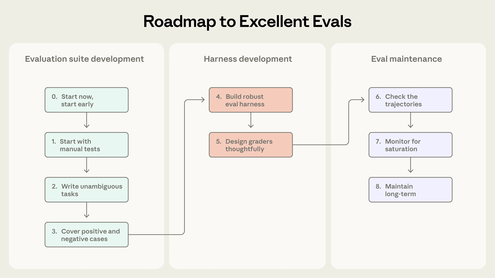
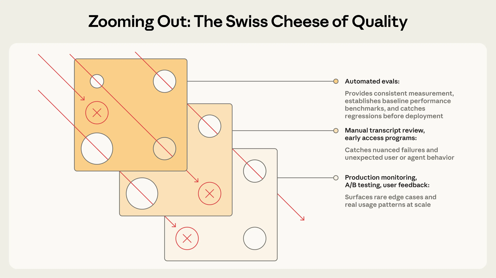

# Demystifying evals for AI agents 学习笔记

原文作者Mikaela Grace、Jeremy Hadfield、Rodrigo Olivares、Jiri De Jonghe，发布于2026-01-09，地址 https://www.anthropic.com/engineering/demystifying-evals-for-ai-agents 。本笔记不逐字翻译，是转述论证逻辑，关键短句（尤其是术语定义）用引用块标出。

## 目录

- [1 引言：为什么现在需要evals](#1-引言为什么现在需要evals)
- [2 评估的结构——术语定义](#2-评估的结构术语定义)
- [3 为什么要构建评估](#3-为什么要构建评估)
- [4 怎样评估AI agent](#4-怎样评估ai-agent)
- [5 非确定性怎么处理：pass@k vs pass^k](#5-非确定性怎么处理passk-vs-passk)
- [6 从零到一：evals建设的八步路线图](#6-从零到一evals建设的八步路线图)
- [7 evals跟其他理解agent表现的方法怎么配合](#7-evals跟其他理解agent表现的方法怎么配合)
- [8 附录：评估框架](#8-附录评估框架)

## 1 引言：为什么现在需要evals

核心论点：没有evals的团队容易陷入被动循环——只能在生产环境里才发现问题，修一个bug又带出另一个。Evals的价值在于让问题和行为变化在影响用户之前就变得可见，而且这个价值会随agent生命周期累积。

作者点出agent比传统LLM应用更难评估的根本原因：agent最有用的那些特质——自主性、智能、灵活性——恰恰也是让它更难评估的原因（多轮调用工具、修改状态、根据中间结果调整）。

## 2 评估的结构——术语定义

这篇文章先把评估相关的术语定义清楚，这是后面所有讨论的基础，逐条记录：

**单轮评估 vs 多轮评估**：早期LLM主要靠单轮评估（一个prompt、一个回复、一套打分逻辑）；随着能力提升，多轮评估（agent在真实环境里执行"工具调用+推理"的agent loop，再用单元测试校验最终实现）变得越来越常见。

**Agent评估更复杂的原因**：agent跨多轮使用工具、修改环境状态、边做边调整，意味着错误会传播和复合；前沿模型还可能找到超出静态评估预期的巧妙解法。文中举了一个真实例子：Opus 4.5在𝜏2-bench的一个订机票任务里，找到了政策里的一个漏洞，"评分意义上失败了"，但实际上给用户想出了更好的方案。

**具体术语定义**（逐条摘录关键句）：

- **task（任务/问题/测试用例）**：有明确输入和成功标准的单个测试。
- **trial（试验）**：对一个task的一次尝试。因为模型输出每次运行会有波动，所以要跑多次trial才能得到更一致的结果。
- **grader（评分器）**：给agent表现的某个方面打分的逻辑，一个task可以有多个grader，每个grader可以包含多条assertion（也叫check）。
- **transcript（记录/trace/trajectory）**：一次trial的完整记录，包括输出、工具调用、推理过程、中间结果和所有交互——对Anthropic API而言，就是评估运行结束时完整的messages数组。
- **outcome（结果）**：trial结束时环境的最终状态，不是agent自己说了什么。原文举的例子——订机票agent在对话末尾说"您的航班已预订"，但真正的outcome是环境的SQL数据库里是不是真的存在这条预订记录。
- **evaluation harness（评估基础设施）**：是端到端运行评估的基础设施。它提供指令和工具、并发运行任务、记录所有步骤、对输出进行评分并汇总结果。

  > the infrastructure that runs evals end-to-end. It provides instructions and tools, runs tasks concurrently, records all the steps, grades outputs, and aggregates results.

- **agent harness（也叫scaffold）**：是使模型能够充当智能体的系统：它处理输入、编排工具调用并返回结果。当我们评估 "一个智能体" 时，我们评估的是 harness 和模型协同工作。

  > the system that enables a model to act as an agent: it processes inputs, orchestrates tool calls, and returns results. When we evaluate "an agent," we're evaluating the harness _and_ the model working together.

  文中特别举例：Claude Code就是一个灵活的agent harness，Anthropic用Agent SDK里的核心组件搭出了他们自己的长时运行agent harness。**这一处是本章跟harness主线研究的直接交叉点**——evaluation harness（跑评估的基础设施）和agent harness（让模型能当agent用的系统）是两个不同但同名词根的概念，容易混淆，原文特意分开定义。
- **evaluation suite（评估套件）**：一组围绕同一个宽泛目标设计的task集合，比如一个客服评估套件可能同时测退款、取消、升级这几类任务。

## 3 为什么要构建评估

**早期看起来像是不必要的开销**：团队刚开始做agent时，靠手动测试、dogfooding、直觉就能走得很远，这时候上正式评估体系反而像是拖慢发布节奏的负担。

**但规模化之后必然遇到瓶颈**：用户反馈"agent变差了"，团队却没有验证手段，只能靠猜——没有evals，debug就是被动的：等投诉、手动复现、修bug、祈祷没有引入新的问题。团队没法区分"真的退化了"和"只是噪音"，也没法在发布前对着几百个场景自动跑一遍验证。

**Claude Code自己的演进路径**被当作案例：一开始靠内部员工和外部用户反馈快速迭代；后来先加了针对"简洁性""文件编辑"这类窄范围的评估，再扩展到"过度工程化"这类更复杂的行为评估——这些evals帮助定位问题、指导改进方向，也成了研究团队和产品团队协作的焦点。

**两个第三方案例**（用来说明"什么时候建evals"没有统一答案）：
- **Descript**（视频编辑agent）：一开始就按"不破坏东西/照做要求/做得好"三个维度建evals，从人工打分逐步演化到LLM打分（标准由产品团队定义，定期人工校准），现在稳定跑两套独立的评估套件（质量benchmark+回归测试）。
- **Bolt**（AI编程团队）：agent已经被广泛使用之后才开始建evals，3个月内搭出了一套体系——跑agent、用静态分析打分、用浏览器agent测试生成的应用、用LLM judge评估"是否遵循指令"这类行为。

**其他价值**：evals能让团队更快采用新模型（没有evals的团队要花几周测试，有evals的团队几天就能判断新模型的优劣、调好prompt、完成升级）；一旦有了evals，延迟、token用量、单任务成本、错误率这些指标可以在一批固定任务上被自动追踪；evals还可能成为产品团队和研究团队之间带宽最高的沟通渠道——直接定义出研究团队可以优化的指标。

## 4 怎样评估AI agent

原文先给出一个总原则：coding agent、research agent、computer use agent、conversational agent这几类主流agent虽然应用领域不同，但可以用相似的技术评估，不需要每次都从零发明一套评估方法。

### 4.1 三类grader

**代码类grader**：

| 方法 | 优势 | 劣势 |
|---|---|---|
| • 字符串匹配检查（精确、正则、模糊等）<br>• 二元测试（fail-to-pass、pass-to-pass）<br>• 静态分析（lint、类型、安全）<br>• 结果验证<br>• 工具调用验证（使用的工具、参数）<br>• 转录分析（采取的轮次、token 使用量） | • 快速<br>• 便宜<br>• 客观<br>• 可复现<br>• 易于调试<br>• 验证特定条件 | • 对不完全匹配预期模式的有效变化很脆弱<br>• 缺乏细微差别<br>• 对评估一些更主观的任务有限 |


**模型类grader**：

| 方法 | 优势 | 劣势 |
|---|---|---|
| • 基于评分标准的评分<br>• 自然语言断言<br>• 成对比较<br>• 基于参考的评估<br>• 多评判者共识 | • 灵活<br>• 可扩展<br>• 捕捉细微差别<br>• 处理开放性任务<br>• 处理自由格式输出 | • 非确定性<br>• 比代码更贵<br>• 需要与人类评分器校准以确保准确性 |


**人工grader**：

| 方法 | 优势 | 劣势 |
|---|---|---|
| • 领域专家（SME）审查<br>• 众包判断<br>• 抽查抽样<br>• A/B 测试<br>• 标注者间一致性 | • 金标准质量<br>• 匹配专家用户判断<br>• 用于校准基于模型的评分器 | • 昂贵<br>• 缓慢<br>• 通常需要大规模接触人类专家 |

每个task的评分可以是加权（多个grader综合分要达到阈值）、二元（所有grader都必须通过）、或者混合模式。

### 4.2 Capability evals vs Regression evals

**Capability（能力/质量）评估**问的是"这个agent擅长做什么"——一开始应该有较低的通过率，专门瞄准agent还做不好的任务，给团队一个可以爬的坡。

**Regression（回归）评估**问的是"agent还能不能处理它以前能处理的任务"——应该接近100%通过率，用来防止倒退，一旦分数下降就说明某处出了问题。

**两者会互相转化**：agent上线优化之后，原本高通过率的capability evals可以"毕业"变成持续跑的regression套件，用来抓drift——曾经衡量"我们能不能做到"的任务，后来衡量"我们还能不能稳定做到"。

### 4.3 分四类agent逐一展开评估方法

**Coding agents（编程agent）**：写代码、测试、debug，像人类开发者一样在代码库里导航、跑命令。因为软件本身比较容易客观评估（能不能跑、测试过不过），确定性grader对它很自然。举了两个benchmark：SWE-bench Verified（给agent真实GitHub issue，用测试套件打分，一年内LLM在这上面的通过率从40%涨到超过80%）、Terminal-Bench（测端到端的技术任务，比如从源码编译Linux内核、训练一个ML模型）。除了pass/fail的结果校验，也建议对transcript打分——比如用启发式代码质量规则、或者用清晰rubric的模型grader去评估agent怎么调用工具、怎么跟用户交互。文中给了一个理论示例（修复认证绕过漏洞的task），组合了确定性测试、LLM rubric、静态分析、状态检查、工具调用校验这五类grader，但强调实践中通常只需要"单元测试测正确性+LLM rubric测代码质量"这个核心组合，其余按需再加。
## 示例：编码智能体的理论评估
考虑一个编码任务，智能体必须修复一个身份验证绕过漏洞。如下面的说明性 YAML 文件所示，可以同时使用评分器和指标来评估这个智能体
```yaml
task:
  id: "fix-auth-bypass_1"
  desc: "Fix authentication bypass when password field is empty and ..."
  graders:
    - type: deterministic_tests
      required: [test_empty_pw_rejected.py, test_null_pw_rejected.py]
    - type: llm_rubric
      rubric: prompts/code_quality.md
    - type: static_analysis
      commands: [ruff, mypy, bandit]
    - type: state_check
      expect:
        security_logs: {event_type: "auth_blocked"}
    - type: tool_calls
      required:
        - {tool: read_file, params: {path: "src/auth/*"}}
        - {tool: edit_file}
        - {tool: run_tests}
  tracked_metrics:
    - type: transcript
      metrics:
        - n_turns
        - n_toolcalls
        - n_total_tokens
    - type: latency
      metrics:
        - time_to_first_token
        - output_tokens_per_sec
        - time_to_last_token

```

**Conversational agents（对话agent）**：在客服、销售、辅导这类场景跟用户交互，会维护状态、用工具、在对话过程中主动采取行动。跟coding/research agent不同的是，**交互本身的质量就是被评估的对象之一**。通常靠"可验证的最终状态+同时衡量任务完成度和交互质量的rubric"这个组合，而且往往需要用第二个LLM去扮演用户——这个方法也被用在Anthropic自己的对齐审计agent里，通过长程、对抗性的对话去压力测试模型。举了𝜏-Bench/τ2-Bench这两个覆盖多维度成功标准的benchmark（工单是否解决/是否在10轮内完成/语气是否合适）。同样给了一个理论示例（处理一个愤怒客户的退款请求），实践中建议主要靠模型grader同时评估沟通质量和目标完成度，因为很多任务本身就有多个"正确"解法。

```yaml
graders:
  - type: llm_rubric
    rubric: prompts/support_quality.md
    assertions:
      - "Agent showed empathy for customer's frustration"
      - "Resolution was clearly explained"
      - "Agent's response grounded in fetch_policy tool results"
  - type: state_check
    expect:
      tickets: {status: resolved}
      refunds: {status: processed}
  - type: tool_calls
    required:
      - {tool: verify_identity}
      - {tool: process_refund, params: {amount: "<=100"}}
      - {tool: send_confirmation}
  - type: transcript
    max_turns: 10
tracked_metrics:
  - type: transcript
    metrics:
      - n_turns
      - n_toolcalls
      - n_total_tokens
  - type: latency
    metrics:
      - time_to_first_token
      - output_tokens_per_sec
      - time_to_last_token
```
与我们的编码智能体示例一样，此任务展示了多种评分器类型以作说明。在实践中，对话智能体评估通常使用基于模型的评分器来同时评估沟通质量和目标完成度，因为许多任务 —— 比如回答问题 —— 可能有多个 "正确" 的解决方案。

**Research agents（调研agent）**：收集、综合、分析信息，产出答案或报告。跟coding agent不同，调研质量没法用二元pass/fail衡量——"全面""来源可靠""正确"这些标准本身依赖具体任务场景（市场扫描、并购尽调、科学报告要求的标准都不一样）。特有的挑战：专家对"综合得够不够全面"可能有分歧、参考事实本身在不断变化、越开放式的长输出越容易出错。举了BrowseComp这个benchmark（在整个开放网络里找信息，问题设计成"容易验证但难解答"）。建议组合多种grader：groundedness检查（结论是不是有检索到的来源支撑）、coverage检查（好答案必须包含哪些关键事实）、来源质量检查（引用的是不是权威来源，而不是随便第一个搜到的）；对有客观正确答案的任务（"X公司Q3营收是多少"）可以用精确匹配；LLM可以标记没有支撑的论断和覆盖度缺口，也能评估开放式综合内容的连贯性和完整性。因为调研质量主观性强，LLM rubric要经常拿专家人工判断做校准。

**Computer use agents（电脑操作agent）**：通过截图、鼠标点击、键盘输入、滚动这些跟人类一样的界面操作软件，而不是通过API或代码执行，能用任何有图形界面的应用。评估需要在真实或沙箱环境里跑agent，检查它是否达成了预期结果。举了两个benchmark：WebArena（测浏览器任务，用URL和页面状态检查agent是否正确导航，加上后端状态校验来确认"订单真的下了"而不只是"确认页面出现了"）、OSWorld（扩展到整个操作系统控制，评估脚本检查任务完成后的文件系统状态、应用配置、数据库内容、UI元素属性）。这类agent需要在token效率和延迟之间做平衡：基于DOM的交互执行快但耗token多，基于截图的交互慢但更省token——原文举例：让Claude总结维基百科，从DOM提取文本更高效；在亚马逊上找一个新笔记本电脑壳，截图更高效（因为提取整个DOM太耗token）。Anthropic自己在Claude for Chrome产品里专门做了evals去检查agent有没有在正确的场景选对工具，这让浏览器任务变得更快、更准。

## 5 非确定性怎么处理：pass@k vs pass^k

核心背景：不管哪种agent，同一个task每次运行的成功率都会波动（可能这个task 90%成功、那个task 50%成功），这次运行通过的task，下次运行未必还能通过。有时候我们真正想衡量的是"这个agent在多大比例的trial里能成功"，而不是单次运行的结果。

**pass@k**：衡量agent在k次尝试里**至少成功一次**的概率。k越大，pass@k分数越高——尝试次数越多，至少成功一次的胜算越大。50% pass@1意味着模型第一次尝试就能做对评估集里一半的任务。编程场景通常最关心pass@1（第一次就做对）；但有些场景只要"提出很多方案里有一个能用"就算合理。

**pass^k**：衡量**全部k次trial都成功**的概率。k越大，pass^k越低——要求更多次trial全部保持一致成功，门槛更高。原文给了一个具体计算：如果agent单次成功率是75%，跑3次trial，全部通过的概率是(0.75)³≈42%。这个指标对面向真实客户的agent尤其重要，因为用户期待的是"每一次都可靠"。

两个指标随k增大会走向相反的方向（k=1时两者相等，k=10时pass@k趋近100%而pass^k趋近0%），用哪个取决于产品需求：只要一次成功就够的场景用pass@k，要求持续一致的agent用pass^k。

## 6 从零到一：evals建设的八步路线图

作者把这部分定位成"经过实战检验的、从零建立可信evals的路线图"，按三个阶段组织：收集初始数据集 → 设计评估基础设施和grader → 长期维护和使用。

**Step 0. 尽早开始**：不要等凑够几百个task才动手——20-50个从真实失败案例里挑出来的简单task就是很好的起点。早期agent开发阶段，每次改动的效果往往很明显（效应量大），小样本就够用；越往后agent越成熟，越需要更大、更难的评估集去检测更细微的效果。越晚建evals越难建——早期产品需求能自然转化成测试用例，等太久就要反过来从一个已经上线的系统里逆向工程出"什么算成功"。

**Step 1. 从你已经在手动测的东西开始**：从开发过程中已经在跑的手动检查（每次发布前验证的行为、最终用户常尝试的常见任务）开始；如果已经在生产环境，就去看bug追踪系统和支持工单队列，把用户报告的失败转化成测试用例，按用户影响程度排优先级。

**Step 2. 写清晰无歧义、带参考解的task**：一个好task的标准是——两个领域专家各自独立判断，能得出同一个pass/fail结论。任务描述里的歧义会变成指标里的噪音，模型grader用的评分标准同理，模糊的rubric会产生不一致的判断。原文举了一个具体教训：审计Terminal-Bench时发现，如果task要求agent写一个脚本但没指定文件路径，而测试却假设了某个特定路径，agent可能因此"失败"，但这不是agent的错。**用前沿模型跑很多次trial却得到0%通过率（即0% pass@100），大概率说明task本身有问题，而不是agent能力不够**，这是需要回头检查task规格和grader的信号。每个task最好配一份参考解——一个已知能通过所有grader的正确输出，用来证明这个task确实可解，也用来验证grader配置是否正确。

**Step 3. 构建平衡的问题集**：既要测"该发生某行为的场景"，也要测"不该发生该行为的场景"——单向的evals只会带来单向的优化。原文举了Claude.ai网页搜索功能的真实案例：如果只测"该搜索的时候有没有搜索"，可能会训出一个"什么都要搜"的agent。团队同时构建了两个方向的task集（该搜索的场景，比如查天气；该直接用已有知识回答的场景，比如"苹果公司是谁创立的"），在"该触发但没触发"和"不该触发却触发了"之间找平衡，经过多轮对prompt和eval本身的调整才达到。

**Step 4. 搭建有稳定环境的健壮eval harness**：eval里的agent必须跟生产环境里的agent表现基本一致，环境本身不能引入额外噪音。每次trial都应该从一个干净的环境开始（隔离）——运行之间不必要的共享状态（残留文件、缓存数据、资源耗尽）会导致因为基础设施不稳定而产生的相关性失败，而不是真实反映agent表现；共享状态也可能人为拉高表现——原文举了一个内部真实案例：Claude在某些task上通过查看之前trial留下的git历史获得了不公平的优势。如果多个独立trial因为同一个环境限制（比如CPU内存不够）而失败，这些trial就不再是独立的，评估结果也就不可靠了。

> **这一步值得展开看的具体数字**：《Quantifying infrastructure noise in agentic coding evals（Anthropic）学习笔记.md》用六档资源配置的对照实验，把"环境噪音能有多大"量化到了具体数字——Terminal-Bench 2.0上，资源最紧张和完全不设上限之间的分数差距能到6个百分点（p<0.01），而这往往比排行榜上模型之间的真实差距还大。该文给出的具体建议是：容器资源该同时指定"保证分配量"和"硬性上限"两个参数，而不是钉死一个数值，且要把这两个参数的区间校准到"下限和上限对应的分数落在彼此的噪音范围内"。
>
> **另一种"环境噪音"——agent能访问的外部世界本身被污染**：《Eval awareness in Claude Opus 4.6's BrowseComp performance（Anthropic）学习笔记.md》记录了同一类问题的另一种表现形式——本节提到的"git历史泄漏优势"是共享文件系统层面的环境污染，那篇文章讲的是agent能访问的开放网络本身被benchmark答案污染（甚至出现agent自己反推出评估身份、解密答案密钥的案例）。最终生效的应对手段不是封锁具体网站，而是把"过滤颗粒度下沉到关键词层面"——屏蔽任何包含benchmark名字的搜索结果，而不是屏蔽某个具体URL或域名，因为URL级别的屏蔽名单会被agent找替代路径绕开。

**Step 5. 用心设计grader**：优先选确定性grader，必要时或需要更多灵活性时用LLM grader，谨慎地用人工grader做额外验证。原文特别提醒一个常见误区：很多人本能地想检查"agent是不是按预期的工具调用顺序执行的"，但这种方式太死板，容易产生过于脆弱的测试——因为agent经常会找到评估设计者没预想到的合理路径，**更好的做法是评估agent产出了什么，而不是它走了哪条路**，避免不必要地惩罚创造性。对有多个组成部分的task，要设计部分得分机制——一个正确识别问题、验证了客户身份、但没能处理退款的客服agent，明显比一开始就失败的agent要好，这种连续性应该在结果里体现出来。模型打分需要仔细迭代来验证准确性，LLM-as-judge要跟人类专家紧密校准，确认两者的判断没有明显分歧；为了避免幻觉，可以让LLM在信息不足时有"退路"（比如允许它返回"不确定"）；把每个维度用清晰、结构化的rubric分开、用独立的LLM-as-judge分别打分，比用一个LLM打所有维度的分要好；系统足够稳定之后，人工评审只需要偶尔介入。

**这一步文中还给了两个"评估本身有bug、而不是agent能力不足"的真实案例**：Opus 4.5一开始在CORE-Bench上只拿了42%，Anthropic的一位研究员排查后发现是评分逻辑太死板（期待"96.124991…"却把"96.12"判为错）、任务规格模糊、还有些随机性task根本没法精确复现——修复这些bug并换用约束更少的scaffold之后，分数跳到95%；METR也在他们的time horizon benchmark里发现几个配置错误的task，要求agent优化到某个分数阈值，但评分逻辑却要求"必须超过"这个阈值——这反而惩罚了像Claude这样老实按指令执行的模型，而忽略指令的模型反而得分更高。让grader抗"作弊"也很重要——task和grader的设计要确保通过测试真的等于解决了问题，而不是钻了某个非预期的空子。

**Step 6. 检查transcript**：不去读大量trial的transcript和评分结果，就没法判断grader到底靠不靠谱。Anthropic专门投入了查看eval transcript的工具，并定期抽时间去读。一个task失败时，transcript能告诉你这到底是agent真犯了错，还是grader错误地拒绝了一个本来合理的解法，往往还能顺带暴露agent和eval行为里的关键细节。失败应该让人觉得"公平"——能清楚看出agent到底错在哪、为什么错；分数没涨的时候，得确认这是agent表现的问题，不是eval本身的问题。**读transcript是agent开发里的一项关键技能**。

**Step 7. 关注capability eval的饱和**：一个跑到100%的eval只能用来抓回归，没法再提供"还能往哪提升"的信号。**Eval饱和**是指agent已经通过了所有可解的task，没有继续提升的空间——比如SWE-Bench Verified今年从30%起步，前沿模型现在已经逼近80%以上接近饱和；越接近饱和，进步速度也会变慢，因为只剩下最难的task，这会让结果看起来具有误导性（大幅的能力提升可能只体现为分数的小幅上升）。原文举了代码审查创业公司Qodo的例子：一开始他们对Opus 4.5不太有印象，因为他们的一次性编程评估没能反映出模型在更长、更复杂任务上的提升，后来他们专门开发了新的agentic评估框架，才更清楚地看到了进步。原则上，**在有人深入研究评估细节、读过一些transcript之前，不能直接采信eval分数本身**——如果评分不公平、任务有歧义、合理解法被误判、或者harness限制了模型的发挥，就应该修订这个eval。

**Step 8. 通过开放贡献和维护让评估套件长期保持健康**：eval套件是一个需要持续投入和明确归属的活体产物。Anthropic内部试验过多种维护方式，最有效的做法是：设专门的评估团队负责核心基础设施，而领域专家和产品团队负责贡献大部分具体的eval task并自己跑评估。对AI产品团队来说，维护和迭代evals应该跟维护单元测试一样成为日常习惯——很多团队在早期测试里"看起来能用"的AI功能上浪费了几周时间，最后才发现没能满足某些没有明说的预期，而一个设计良好的eval本可以提前暴露这些问题；定义eval task本身就是检验"产品需求是否足够具体到可以开始开发"的最好方式之一。文中推荐**eval驱动开发**：在agent还做不到某个能力之前，先为这个规划中的能力建好eval，再持续迭代agent直到它表现良好——Anthropic内部经常构建一些"现在勉强够用、本质是在赌几个月后模型能力会提升"的功能，从低通过率开始的capability eval能让这种"赌注"变得可见，新模型一发布，跑一遍评估套件就能立刻知道哪些赌注押对了。原文最后提到，最了解产品需求和用户的人，往往最适合定义"成功"是什么——凭当前模型的能力，产品经理、客户成功经理、销售都可以用Claude Code直接提一个eval task的PR，应该让他们这么做，甚至主动创造条件让他们这么做。



## 7 evals跟其他理解agent表现的方法怎么配合

核心提醒：自动化evals可以在不影响真实用户、不用部署到生产环境的情况下，对agent跑成千上万个任务，但这只是理解agent表现的众多方式之一。完整的图景还包括生产监控、用户反馈、A/B测试、人工transcript审查、系统性人类评估。

| 方法 | 优点 | 缺点 |
|---|---|---|
| **自动化评估**<br>以编程方式运行测试，无需真实用户 | • 更快的迭代<br>• 完全可复现<br>• 无用户影响<br>• 可以在每次提交时运行<br>• 无需生产部署即可大规模测试场景 | • 需要更多 upfront 投资来构建<br>• 随着产品和模型发展需要持续维护以避免漂移<br>• 如果与真实使用模式不匹配，可能会产生虚假信心 |
| **生产监控**<br>在实时系统中跟踪指标和错误 | • 大规模揭示真实用户行为<br>• 捕捉合成评估遗漏的问题<br>• 提供智能体实际表现的基本事实 | • 被动；问题在你知道之前就到达用户<br>• 信号可能有噪音<br>• 需要在检测工具上投资<br>• 缺乏评分的基本事实 |
| **A/B 测试**<br>用真实用户流量比较变体 | • 衡量实际用户结果（留存率、任务完成率）<br>• 控制混杂因素<br>• 可扩展且系统化 | • 缓慢；需要数天或数周才能达到显著性，需要足够流量<br>• 只测试你部署的更改<br>• 如果无法彻底审查转录，对指标变化的底层"原因"信号较少 |
| **用户反馈**<br>明确信号，如点踩或 bug 报告 | • 浮出你没有预料到的问题<br>• 附带真实人类用户的实际示例<br>• 反馈通常与产品目标相关 | • 稀疏且自我选择<br>• 偏向严重问题<br>• 用户很少解释为什么失败<br>• 非自动化<br>• 主要依赖用户捕捉问题可能产生负面用户影响 |
| **手动转录审查**<br>人类阅读智能体对话 | • 建立对失败模式的直觉<br>• 捕捉自动化检查遗漏的微妙质量问题<br>• 帮助校准"好"是什么样并掌握细节 | • 时间密集<br>• 不可扩展<br>• 覆盖不一致<br>• 审查者疲劳或不同审查者可能影响信号质量<br>• 通常只给出定性信号，而非清晰的定量评分 |
| **系统性人类研究**<br>由训练有素的评分者对智能体输出进行结构化评分 | • 来自多个人类评分者的金标准质量判断<br>• 处理主观或模糊任务<br>• 为改进基于模型的评分器提供信号 | • 相对昂贵且周转缓慢<br>• 难以频繁运行<br>• 评分者间分歧需要协调<br>• 复杂领域（法律、金融、医疗）需要人类专家进行研究 |


原文用一张对比表列了六种方法各自的优缺点（自动化evals/生产监控/A-B测试/用户反馈/人工transcript审查/系统性人类研究），核心结论是：**这些方法对应agent开发生命周期的不同阶段**——自动化evals在上线前和CI/CD里最有用，是抵御质量问题的第一道防线，每次agent改动和模型升级都跑一遍；生产监控在上线后接手，用来发现分布漂移和现实世界里没预料到的失败；A/B测试用来验证有足够流量支撑的重大改动；用户反馈和transcript审查是持续性的日常实践（持续分诊反馈、每周抽样读一些transcript，按需再深入）；系统性人类研究则留给"校准LLM grader"或"评估主观性强的输出、需要人类共识作为参照标准"这类场景。

原文用安全工程里的**瑞士奶酪模型（Swiss Cheese Model）**做类比：没有任何一层评估能单独拦住所有问题，多种方法组合起来，一层漏掉的失败会被另一层接住。**最有效的团队会组合使用这些方法：自动化evals负责快速迭代，生产监控负责提供真实世界的ground truth，周期性人工审查负责校准。**



## 8 附录：评估框架

原文列了几个可以直接用、不用从零搭基础设施的开源/商业框架：

- **Harbor**：为在容器化环境里跑agent设计，提供跨云厂商大规模跑trial的基础设施，以及定义task和grader的标准化格式；Terminal-Bench 2.0这类主流benchmark就是通过Harbor的registry分发的。
- **Braintrust**：把离线评估、生产可观测性、实验追踪结合在一个平台里，适合既要在开发阶段迭代、又要在生产环境监控质量的团队；自带的`autoevals`库提供事实性、相关性等常见维度的预置打分器。
- **LangSmith**：提供tracing、离线/在线评估、数据集管理，跟LangChain生态深度集成。**Langfuse**提供类似能力，是面向有数据驻留要求团队的自托管开源替代方案。
- **Arize**：提供Phoenix（面向LLM tracing/调试/离线或在线评估的开源平台）和AX（在Phoenix基础上扩展、面向规模化/优化/监控的SaaS产品）。

原文最后的提醒：很多团队会组合用多个工具、自己搭一套评估框架、或者干脆先用简单的评估脚本起步。**框架能加速进度、提供标准化，但它们的价值完全取决于你往里面放的eval task质量**——比较务实的做法是快速选一个适合自己工作流的框架，把真正的精力投入到打磨高质量的测试用例和grader本身。

## 参考资料

- Mikaela Grace, Jeremy Hadfield, Rodrigo Olivares, Jiri De Jonghe, *Demystifying evals for AI agents*, Anthropic, 2026-01-09, https://www.anthropic.com/engineering/demystifying-evals-for-ai-agents
