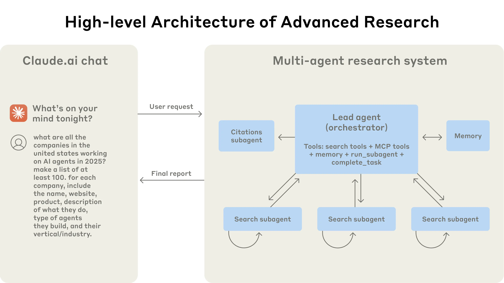
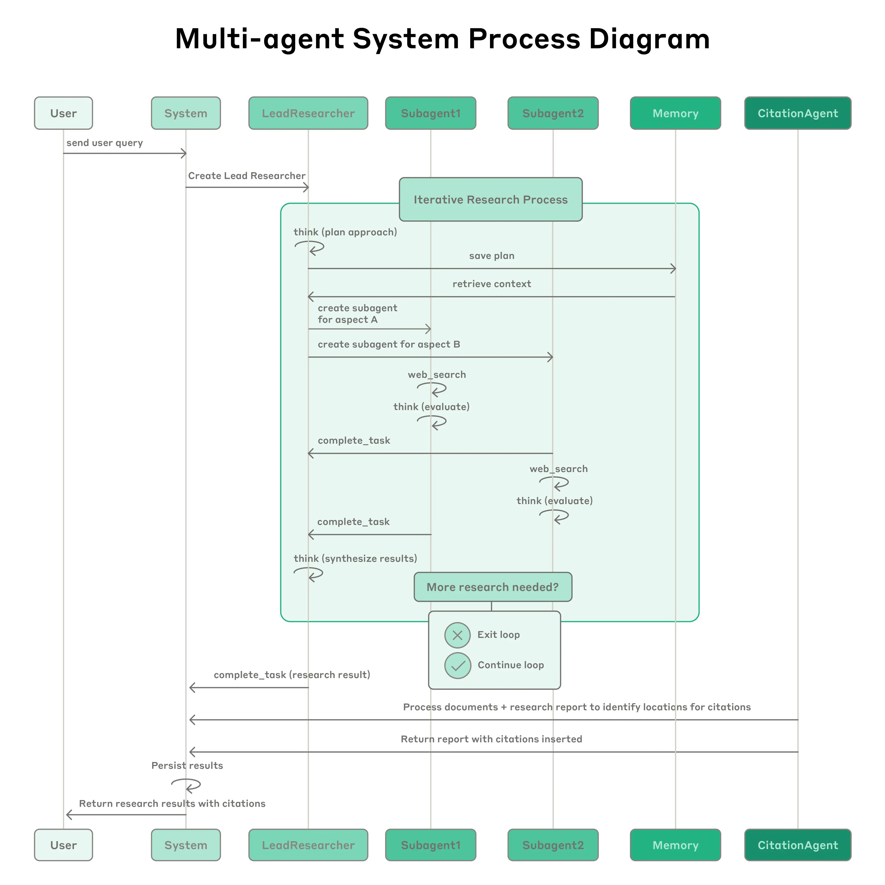

Claude 现在拥有了 [Research 功能](https://www.anthropic.com/news/research)，使其能够搜索整个网络、Google Workspace 以及任何集成，以完成复杂任务。

这个多智能体系统从原型到生产的旅程，教会了我们关于系统架构、工具设计和提示词工程的关键经验。多智能体系统由多个智能体（在循环中自主使用工具的 LLM）协同工作组成。我们的 Research 功能包含一个智能体，它根据用户查询规划研究流程，然后使用工具创建并行智能体来同时搜索信息。拥有多个智能体的系统在智能体协调、评估和可靠性方面引入了新的挑战。

本文拆解了对我们行之有效的原则 —— 希望你在构建自己的多智能体系统时能发现它们的用处。

# 多智能体系统的好处

研究工作涉及开放性问题，很难提前预测所需的步骤。你不能为探索复杂主题硬编码一条固定路径，因为这个过程本质上是动态的、路径依赖的。当人们进行研究时，他们往往会根据发现不断更新自己的方法，追踪调查过程中浮现的线索。

这种不可预测性使 AI 智能体特别适合研究任务。研究要求在调查展开时具备转向或探索 tangential 关联的灵活性。模型必须自主运行多轮，根据中间发现决定追求哪些方向。线性的、一次性的流水线无法处理这些任务。

搜索的本质是压缩：从庞大的语料库中提炼洞见。子智能体通过并行运行、拥有各自的上下文窗口来促进压缩，同时探索问题的不同方面，然后为首席研究智能体浓缩最重要的 token。每个子智能体还提供关注点分离 —— 不同的工具、提示词和探索轨迹 —— 这减少了路径依赖，并实现了彻底、独立的调查。

一旦智能达到某个阈值，多智能体系统就成为扩展性能的重要方式。例如，尽管人类个体在过去 10 万年中变得更加聪明，但人类社会在信息时代的能力呈指数级增长，这得益于我们的集体智慧和协调能力。即使是通用智能体，作为个体运作时也会面临限制；智能体群体可以完成更多事情。

我们的内部评估表明，多智能体研究系统尤其擅长广度优先的查询，即同时追求多个独立方向。我们发现，以 Claude Opus 4 作为首席智能体、Claude Sonnet 4 作为子智能体的多智能体系统，在我们的内部研究评估中比单智能体 Claude Opus 4 高出 90.2%。例如，当被要求识别标普 500 信息技术板块所有公司的董事会成员时，多智能体系统通过将其分解为子智能体的任务找到了正确答案，而单智能体系统由于缓慢的顺序搜索未能找到答案。

多智能体系统之所以有效，主要是因为它们帮助消耗足够的 token 来解决问题。在我们的分析中，三个因素解释了 [BrowseComp](https://openai.com/index/browsecomp/) 评估（测试浏览智能体定位难以找到的信息的能力）中 95% 的性能差异。我们发现，仅 token 使用量就解释了 80% 的差异，工具调用次数和模型选择是另外两个解释因素。这一发现验证了我们的架构 —— 将工作分布在拥有独立上下文窗口的智能体之间，以增加并行推理的能力。最新的 Claude 模型在 token 使用上充当了大型效率倍增器，因为升级到 Claude Sonnet 4 比在 Claude Sonnet 3.7 上翻倍 token 预算带来的性能提升更大。多智能体架构有效地为超出单智能体限制的任务扩展了 token 使用量。

但有一个缺点：在实践中，这些架构消耗 token 很快。在我们的数据中，智能体通常比聊天交互多使用约 4 倍的 token，而多智能体系统比聊天多使用约 15 倍的 token。为了经济上可行，多智能体系统需要任务价值足够高，以支付增加的性能成本。此外，一些要求所有智能体共享相同上下文或涉及智能体之间许多依赖关系的领域，目前并不适合多智能体系统。例如，大多数编码任务涉及的真正可并行化任务比研究少，而且 LLM 智能体还不擅长实时协调和委派给其他智能体。我们发现，多智能体系统擅长那些涉及大量并行化、超出单上下文窗口的信息以及与众多复杂工具交互的有价值任务。

# Research 的架构概述

我们的 Research 系统采用多智能体架构，使用编排者 - 工作者（orchestrator-worker）模式，其中一个首席智能体协调整个流程，同时委派给并行运行的专门子智能体。

多智能体架构的实际运作：用户查询流经一个首席智能体，该智能体创建专门的子智能体来并行搜索不同方面。

当用户提交查询时，首席智能体分析它、制定策略，并生成子智能体来同时探索不同方面。如上图所示，子智能体充当智能过滤器，通过迭代使用搜索工具收集信息（在本例中是关于 2025 年的 AI 智能体公司），然后将公司列表返回给首席智能体，以便它编制最终答案。

使用检索增强生成（RAG）的传统方法采用静态检索。也就是说，它们获取与输入查询最相似的一组块，并使用这些块生成响应。相比之下，我们的架构使用多步搜索，动态查找相关信息、适应新发现并分析结果，以制定高质量的答案。

流程图展示了我们的多智能体 Research 系统的完整工作流程。当用户提交查询时，系统创建一个 LeadResearcher（首席研究员）智能体，它进入一个迭代研究过程。LeadResearcher 首先思考方法并将其计划保存到 Memory 中以持久化上下文，因为如果上下文窗口超过 200,000 个 token，它将被截断，而保留计划非常重要。然后它创建具有特定研究任务的专门子智能体（此处显示两个，但可以是任意数量）。每个子智能体独立执行网络搜索，使用[交错思考（interleaved thinking）](https://docs.anthropic.com/en/docs/build-with-claude/extended-thinking#interleaved-thinking)评估工具结果，并将发现返回给 LeadResearcher。LeadResearcher 综合这些结果并决定是否需要更多研究 —— 如果需要，它可以创建额外的子智能体或完善其策略。一旦收集到足够的信息，系统退出研究循环，并将所有发现传递给 CitationAgent（引用智能体），该智能体处理文档和研究报告以识别引用的具体位置。这确保所有声明都正确归因于其来源。最终的研究结果（附有引用）随后返回给用户。

# 研究智能体的提示词工程与评估
多智能体系统与单智能体系统有关键区别，包括协调复杂性的快速增长。早期的智能体会犯这样的错误：为简单查询生成 50 个子智能体、无休止地在网上搜寻不存在的来源、以及通过过度更新相互干扰。由于每个智能体都由提示词引导，提示词工程是我们改善这些行为的主要手段。以下是我们学到的一些提示智能体的原则：

- **像你的智能体一样思考。** 要迭代提示词，你必须理解它们的效果。为了帮助我们做到这一点，我们使用 [Anthropic Console](https://console.anthropic.com/) 构建了模拟，使用系统中的确切提示词和工具，然后逐步观察智能体工作。这立即揭示了失败模式：智能体在已经有足够结果时仍继续、使用过于冗长的搜索查询、或选择错误的工具。有效的提示词依赖于建立对智能体的准确心智模型，这可以使最有影响力的改变变得显而易见。
- **教会编排者如何委派。** 在我们的系统中，首席智能体将查询分解为子任务，并向子智能体描述它们。每个子智能体需要一个目标、一种输出格式、关于使用哪些工具和来源的指导，以及清晰的任务边界。没有详细的任务描述，智能体会重复工作、留下空白、或未能找到必要的信息。我们一开始允许首席智能体给出简单、简短的指令，比如 "研究半导体短缺"，但发现这些指令往往过于模糊，以至于子智能体误解任务，或执行与其他智能体完全相同的搜索。例如，一个子智能体探索了 2021 年汽车芯片危机，而另外两个子智能体重复了调查当前 2025 年供应链的工作，没有有效的分工。
- **根据查询复杂度扩展努力程度。** 智能体很难判断不同任务的适当努力程度，因此我们在提示词中嵌入了扩展规则。简单的事实查找只需要 1 个智能体和 3-10 次工具调用，直接比较可能需要 2-4 个子智能体，每个 10-15 次调用，而复杂研究可能使用超过 10 个具有明确分工的子智能体。这些明确的指导方针帮助首席智能体高效分配资源，并防止在简单查询上过度投入 —— 这是我们早期版本中常见的失败模式。
- **工具设计和选择至关重要。** 智能体 - 工具接口与人机接口一样关键。使用正确的工具是高效的 —— 通常，这是绝对必要的。例如，一个在网上搜索只存在于 Slack 中的上下文的智能体从一开始就注定失败。随着 [模型上下文协议（MCP）](https://modelcontextprotocol.io/introduction) 让模型能够访问外部工具，这个问题变得更加复杂，因为智能体会遇到描述质量参差不齐的未知工具。我们给了智能体明确的启发式规则：例如，首先检查所有可用工具，将工具使用与用户意图匹配，使用网络搜索进行广泛的外部探索，或优先使用专门工具而非通用工具。糟糕的工具描述会让智能体走上完全错误的道路，因此每个工具都需要明确的用途和清晰的描述。
- **让智能体自我改进。** 我们发现 Claude 4 模型可以成为出色的提示词工程师。当给定一个提示词和一个失败模式时，它们能够诊断智能体失败的原因并提出改进建议。我们甚至创建了一个工具测试智能体 —— 当给定一个有缺陷的 MCP 工具时，它会尝试使用该工具，然后重写工具描述以避免失败。通过对该工具进行数十次测试，这个智能体发现了关键的细微差别和 bug。这种改善工具人机工程学的过程，使未来使用新描述的智能体的任务完成时间减少了 40%，因为它们能够避免大多数错误。
- **从广泛开始，然后收窄。** 搜索策略应该模仿专家级的人类研究：在深入具体细节之前先探索全貌。智能体往往默认使用过于冗长、具体的查询，返回的结果很少。我们通过提示智能体从简短、广泛的查询开始，评估可用内容，然后逐步收窄焦点，来抵消这种倾向。
- **引导思考过程。** [扩展思考（extended thinking）](https://docs.anthropic.com/en/docs/build-with-claude/extended-thinking)引导 Claude 在可见的思考过程中输出额外的 token，可以作为一个可控的草稿本。首席智能体使用思考来规划其方法，评估哪些工具适合任务，确定查询复杂度和子智能体数量，并定义每个子智能体的角色。我们的测试表明，扩展思考改善了指令遵循、推理和效率。子智能体也会规划，然后在工具结果之后使用[交错思考（interleaved thinking）](https://docs.anthropic.com/en/docs/build-with-claude/extended-thinking#interleaved-thinking)来评估质量、识别空白并完善下一个查询。这使子智能体在适应任何任务时更加有效。
- **并行工具调用改变了速度和性能。** 复杂的研究任务自然涉及探索许多来源。我们早期的智能体执行顺序搜索，速度慢得令人痛苦。为了提高速度，我们引入了两种并行化：（1）首席智能体并行启动 3-5 个子智能体，而不是串行；（2）子智能体并行使用 3 个以上的工具。这些更改将复杂查询的研究时间缩短了高达 90%，使 Research 能在几分钟内而不是几小时内完成更多工作，同时覆盖比其他系统更多的信息。

我们的提示词策略侧重于灌输良好的启发式规则，而不是僵化的规则。我们研究了熟练的人类如何处理研究任务，并将这些策略编码到我们的提示词中 —— 诸如将困难问题分解为更小的任务、仔细评估来源质量、根据新信息调整搜索方法，以及认识到何时应该专注于深度（详细调查一个主题）与广度（并行探索许多主题）等策略。我们还通过设置明确的护栏来主动减轻意外的副作用，以防止智能体失控。最后，我们专注于一个带有可观测性和测试用例的快速迭代循环。

# 智能体的有效评估
良好的评估对于构建可靠的 AI 应用至关重要，智能体也不例外。然而，评估多智能体系统带来了独特的挑战。传统评估通常假设 AI 每次都遵循相同的步骤：给定输入 X，系统应该遵循路径 Y 来产生输出 Z。但多智能体系统不是这样工作的。即使起点相同，智能体也可能采取完全不同但有效的路径来达成目标。一个智能体可能搜索三个来源，而另一个搜索十个，或者它们可能使用不同的工具找到相同的答案。因为我们并不总是知道正确的步骤是什么，我们通常不能只检查智能体是否遵循了我们预先规定的 "正确" 步骤。相反，我们需要灵活的评估方法，判断智能体是否达成了正确的结果，同时也遵循了合理的过程。

- **立即用小样本开始评估。** 在智能体开发早期，变化往往具有戏剧性的影响，因为有大量唾手可得的改进。一个提示词调整可能将成功率从 30% 提升到 80%。在效果如此之大的情况下，仅用几个测试用例就能发现变化。我们从一组约 20 个代表真实使用模式的查询开始。测试这些查询通常能让我们清楚地看到变化的影响。我们经常听到 AI 开发团队推迟创建评估，因为他们认为只有包含数百个测试用例的大型评估才有用。然而，最好立即用几个例子进行小规模测试，而不是推迟到你能构建更全面的评估时。
- **LLM 作为评判者的评估在做得好时可以扩展。** 研究输出很难用程序评估，因为它们是自由格式的文本，很少有单一的正确答案。LLM 天然适合给输出打分。我们使用了一个 LLM 评判者，根据评分标准中的标准评估每个输出：事实准确性（声明是否与来源匹配？）、引用准确性（引用的来源是否与声明匹配？）、完整性（是否涵盖了所有要求的方面？）、来源质量（是否优先使用了主要来源而非低质量的次要来源？）、以及工具效率（是否以合理的次数使用了正确的工具？）。我们尝试了用多个评判者来评估每个组件，但发现单次 LLM 调用、单个提示词输出 0.0-1.0 的分数和通过 / 失败等级是最一致的，也最符合人类判断。当评估测试用例确实有明确答案时，这种方法特别有效，我们可以用 LLM 评判者简单地检查答案是否正确（例如，它是否准确列出了研发预算前三的制药公司？）。使用 LLM 作为评判者使我们能够可扩展地评估数百个输出。
- **人类评估能捕捉自动化遗漏的内容。** 测试智能体的人会发现评估遗漏的边缘情况。这些包括在不寻常查询上的幻觉答案、系统故障、或微妙的来源选择偏差。在我们的案例中，人类测试人员注意到我们早期的智能体始终选择 SEO 优化的内容农场，而不是学术 PDF 或个人博客等权威性较高但排名较低的来源。在提示词中添加来源质量启发式规则帮助解决了这个问题。即使在自动化评估的世界里，手动测试仍然至关重要。

多智能体系统具有涌现行为，这些行为在没有特定编程的情况下出现。例如，对首席智能体的微小变化可能不可预测地改变子智能体的行为方式。成功需要理解交互模式，而不仅仅是单个智能体的行为。因此，这些智能体的最佳提示词不仅仅是严格的指令，而是定义分工、问题解决方法和努力预算的协作框架。做好这一点依赖于仔细的提示词和工具设计、扎实的启发式规则、可观测性和紧密的反馈循环。示例提示词请参见 [智能体基本工作流模式](https://platform.claude.com/cookbook/patterns-agents-basic-workflows)。

# 生产可靠性与工程挑战

在传统软件中，一个 bug 可能会破坏某个功能、降低性能或导致停机。在智能体系统中，微小的变化会级联成巨大的行为变化，这使得为必须在长时间运行的进程中维护状态的复杂智能体编写代码变得异常困难。

- **智能体是有状态的，错误会累积。** 智能体可以长时间运行，在多次工具调用中维护状态。这意味着我们需要持久地执行代码并在过程中处理错误。如果没有有效的缓解措施，微小的系统故障对智能体来说可能是灾难性的。当错误发生时，我们不能只是从头重新开始：重新启动成本高昂，也让用户感到沮丧。相反，我们构建了可以从智能体出错时的位置恢复的系统。我们还利用模型的智能来优雅地处理问题：例如，让智能体知道某个工具正在失败并让它适应，效果出奇地好。我们将基于 Claude 的 AI 智能体的适应性与重试逻辑和定期检查点等确定性保障措施相结合。
- **调试受益于新方法。** 智能体会做出动态决策，即使使用相同的提示词，每次运行之间也是非确定性的。这使得调试更加困难。例如，用户会报告智能体 "找不到明显的信息"，但我们看不出原因。是智能体使用了糟糕的搜索查询？选择了不好的来源？遇到了工具故障？添加完整的生产追踪让我们能够诊断智能体失败的原因并系统地修复问题。除了标准的可观测性之外，我们还监控智能体的决策模式和交互结构 —— 所有这些都不监控单个对话的内容，以维护用户隐私。这种高级别的可观测性帮助我们诊断根本原因、发现意外行为并修复常见故障。
- **部署需要仔细协调。** 智能体系统是由提示词、工具和执行逻辑组成的高度有状态的网络，几乎持续运行。这意味着每当我们部署更新时，智能体可能处于其流程中的任何位置。因此，我们需要防止我们善意的代码更改破坏现有的智能体。我们不能同时将每个智能体更新到新版本。相反，我们使用[彩虹部署（rainbow deployments）](https://brandon.dimcheff.com/2018/02/rainbow-deploys-with-kubernetes/)来避免中断运行中的智能体，通过逐步将流量从旧版本转移到新版本，同时保持两者同时运行。
- **同步执行会产生瓶颈。** 目前，我们的首席智能体同步执行子智能体，等待每组子智能体完成后再继续。这简化了协调，但在智能体之间的信息流中产生了瓶颈。例如，首席智能体无法引导子智能体，子智能体无法协调，整个系统可能在等待单个子智能体完成搜索时被阻塞。异步执行将实现额外的并行性：智能体并发工作，并在需要时创建新的子智能体。但这种异步性在结果协调、状态一致性和跨子智能体的错误传播方面增加了挑战。随着模型能够处理更长、更复杂的研究任务，我们预计性能提升将证明这种复杂性是值得的。

# 结论
在构建 AI 智能体时，最后一公里往往成为旅程的大部分。在开发者机器上运行的代码库需要大量工程工作才能成为可靠的生产系统。智能体系统中错误的累积性质意味着，传统软件中的小问题可能会完全使智能体脱轨。一个步骤的失败可能导致智能体探索完全不同的轨迹，导致不可预测的结果。由于本文描述的所有原因，原型与生产之间的差距往往比预期的更大。

尽管存在这些挑战，多智能体系统已被证明对开放性研究任务有价值。用户表示，Claude 帮助他们找到了未曾考虑过的商业机会、驾驭了复杂的医疗保健选择、解决了棘手的技术 bug，并通过发现他们独自无法找到的研究关联节省了多达数天的工作。通过精心的工程设计、全面的测试、注重细节的提示词和工具设计、稳健的运维实践，以及对当前智能体能力有深刻理解的研究、产品和工程团队之间的紧密协作，多智能体研究系统可以在大规模上可靠运行。我们已经看到这些系统正在改变人们解决复杂问题的方式。

一张 [Clio 嵌入图](https://www.anthropic.com/research/clio)展示了当今人们使用 Research 功能的最常见方式。排名靠前的用例类别是：跨专业领域开发软件系统（10%）、开发和优化专业与技术内容（8%）、制定业务增长和创收策略（8%）、协助学术研究和教育材料开发（7%）、以及研究和验证关于人物、地点或组织的信息（5%）。

## 附录

以下是一些关于多智能体系统的额外杂项提示。
- **对在多轮中变更状态的智能体进行终态评估。** 评估在多轮对话中修改持久状态的智能体带来了独特的挑战。与只读研究任务不同，每个动作都可能改变后续步骤的环境，产生传统评估方法难以处理的依赖关系。我们发现，专注于终态评估而不是逐轮分析是成功的。与其判断智能体是否遵循了特定过程，不如评估它是否达成了正确的最终状态。这种方法承认智能体可能找到通往同一目标的替代路径，同时仍确保它们交付预期的结果。对于复杂的工作流，将评估分解为离散的检查点，在这些检查点上应该发生特定的状态变化，而不是尝试验证每个中间步骤。
- **长程对话管理。** 生产智能体经常参与跨越数百轮的对话，需要仔细的上下文管理策略。随着对话的延伸，标准上下文窗口变得不足，需要智能压缩和记忆机制。我们实现了这样的模式：智能体总结已完成的工作阶段，并在继续新任务之前将基本信息存储在外部记忆中。当接近上下文限制时，智能体可以生成具有干净上下文的新子智能体，同时通过仔细的交接保持连续性。此外，它们可以从记忆中检索存储的上下文（如研究计划），而不是在达到上下文限制时丢失之前的工作。这种分布式方法防止了上下文溢出，同时在扩展交互中保持了对话连贯性。
- **将子智能体输出到文件系统以最小化 "传话游戏"。** 对于某些类型的结果，子智能体的直接输出可以绕过主协调器，从而提高保真度和性能。与其要求子智能体通过首席智能体传达所有内容，不如实现产物系统，让专门的智能体可以创建独立持久化的输出。子智能体调用工具将其工作存储在外部系统中，然后将轻量级引用传递回协调器。这防止了多阶段处理过程中的信息丢失，并减少了通过对话历史复制大型输出的 token 开销。这种模式特别适用于结构化输出，如代码、报告或数据可视化，在这些场景中，子智能体的专门提示词比通过通用协调器过滤能产生更好的结果。
