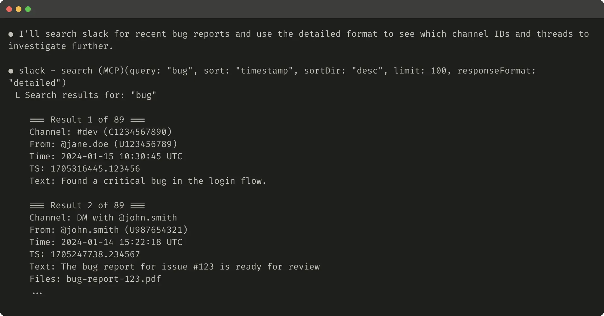
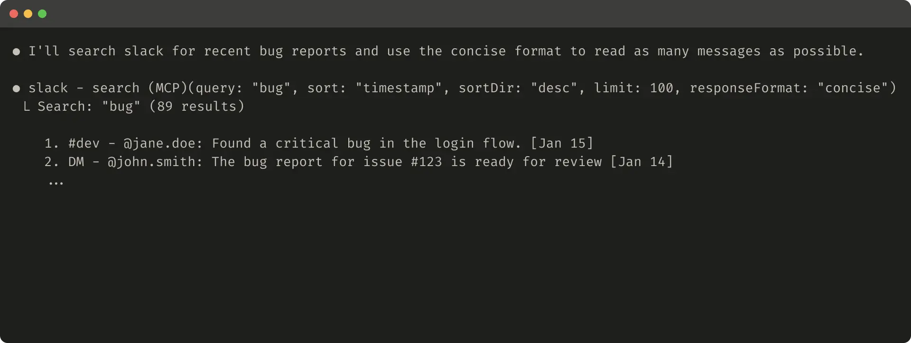
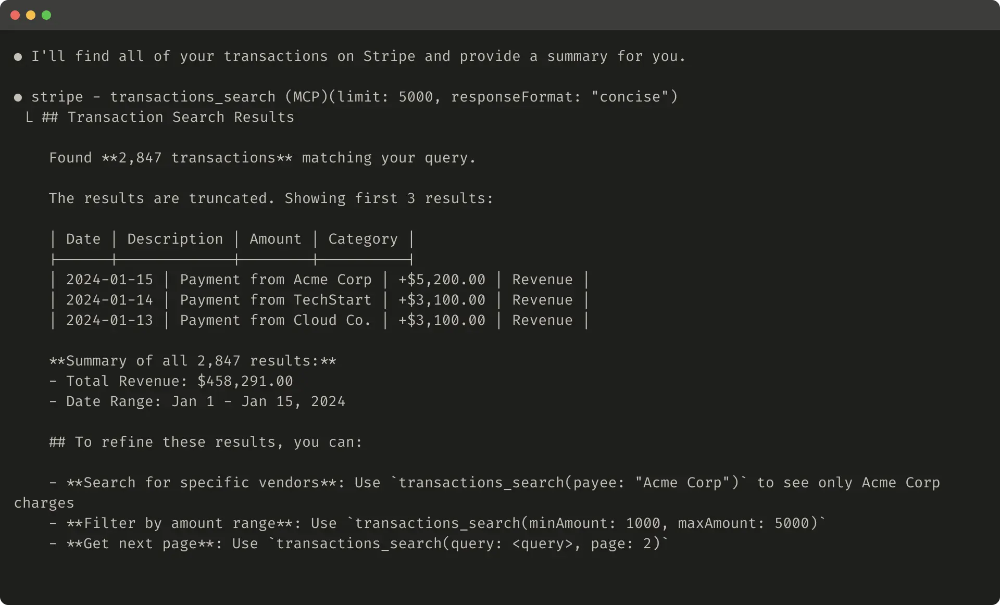
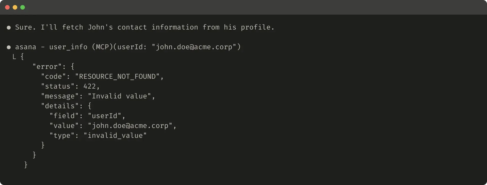
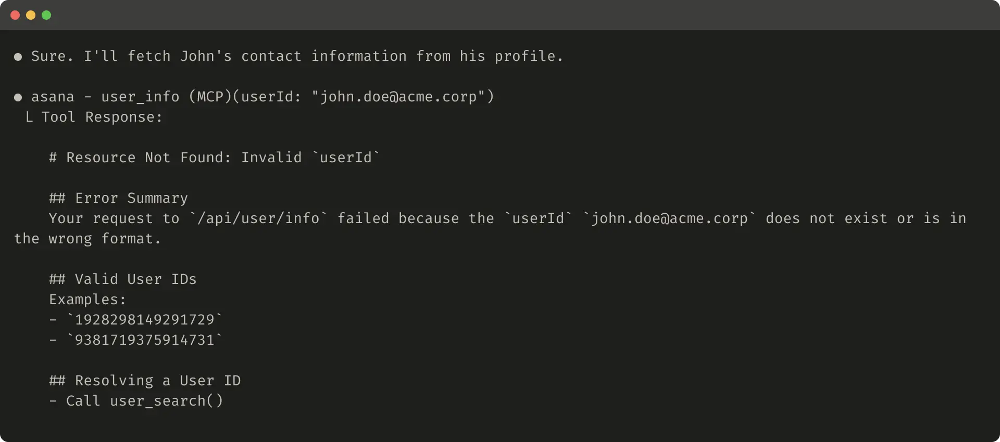

```text
Agent 的能力取决于我们赋予它的工具质量。我们将分享如何编写高质量的工具和评估体系，以及如何利用 Claude 自身来优化它所使用的工具，从而进一步提升性能。
```

模型上下文协议（Model Context Protocol，MCP） 可以为 LLM Agent 提供数百个潜在工具（Tools），帮助它们解决现实世界中的复杂任务。但是： 我们如何才能让这些工具发挥最大的效果？

在这篇文章中，我们将介绍一系列经过验证、最有效的技术，用于提升各种 Agentic AI 系统的性能。

本文首先介绍如何：

- 构建并测试工具原型（prototypes）
- 使用 Agent 创建并运行全面的工具评估（evaluations）
- 与 Claude Code 等 Agent 协作，自动提升工具性能

最后，我们总结在实践过程中发现的高质量工具设计原则：
- 选择正确的工具进行实现（以及哪些工具不应该实现）
- 使用命名空间（Namespacing）定义清晰的功能边界
- 从工具返回有意义的上下文信息给 Agent
- 优化工具响应，提高 Token 使用效率
- 使用 Prompt Engineering 优化工具描述和规范（Specs）

# 什么是工具（Tool）？
在计算机领域中，确定性系统（deterministic systems） 是指：当输入完全相同时，每次都会产生完全相同输出的系统。而非确定性系统（non-deterministic systems）——例如 Agent（智能体）——则不同：即使初始条件相同，也可能产生不同的响应结果。

传统的软件开发，本质上是在建立：确定性系统之间的契约（contract）。例如：```getWeather("NYC")``` 这样的函数调用，每次执行都会： 获取纽约市天气； 按照相同的逻辑处理； 返回相同格式的结果。因为函数行为是确定的。

但是，Tool（工具）是一种新的软件形式。它体现的是：确定性系统与非确定性 Agent 之间的契约。举个例子：用户问：```“我今天应该带伞吗？”```。Agent 可能采取不同策略：策略 1：调用天气工具,策略 2：直接根据已有知识回答,策略 3：先询问用户更多信息.甚至有时候 Agent 可能： 产生幻觉（hallucination）； 不理解如何使用某个 Tool； 调用了错误的工具； 使用错误的参数。

这意味着当我们为 Agent 编写软件时，需要重新思考传统的软件设计方式。我们不能再像过去为： 其他开发者、传统系统 那样设计函数和 API 那样设计 Tool 和 MCP Server。相反：我们需要针对 Agent 的特点来设计工具。

我们的目标是： 通过工具，让 Agent 能够采用更多有效策略，从而解决更广泛的问题。工具不是简单地提供一个 API。 它应该帮助 Agent： 理解任务； 选择正确行动； 获取必要信息； 完成复杂目标。幸运的是，根据我们的经验：对 Agent 来说最“符合人体工程学（ergonomic）”的工具设计，往往也会让人类用户觉得非常直观易懂。

# 如何编写工具（How to write tools）
在这一部分，我们将介绍：如何与 Agent 协作，不仅编写工具，还持续改进提供给 Agent 使用的工具。推荐的流程如下：快速搭建工具原型，并进行本地测试。运行全面评估（evaluation），衡量后续改动的效果。与 Agent 协作，不断评估和优化工具。重复这个过程，直到 Agent 在真实任务中达到较强表现。

## 构建原型（Building a prototype）
如果没有亲自实践，很难提前判断：哪些工具对 Agent 来说易于使用， 哪些工具会让 Agent 感到困难。因此， 第一件事应该是快速搭建一个工具原型。如果你使用： Claude Code 来编写工具（甚至一次性生成整个工具实现），建议为 Claude 提供它所依赖的软件资料，例如：```软件库文档```, ```API 文档```, ```SDK 文档```, ```MCP SDK 文档```。很多官方文档网站都会提供llms.txt格式的文档文件，这种格式专门针对 LLM 阅读进行了优化。
使用 MCP Server 或 Desktop Extension 测试工具 将你的工具封装成： 本地 MCP Server 或者 Desktop Extension（DXT）。可以让你：在 Claude Code、Claude Desktop 中连接、测试。

连接本地 MCP Server 到 Claude Code 执行：
```bash
claude mcp add <name> <command> [args...]
```
之后 Claude Code 就可以调用你的本地 MCP Server。
连接 MCP Server 或 DXT 到 Claude Desktop ,进入： MCP Server：```Settings > Developer```，Desktop Extension：```Settings > Extensions```

亲自测试工具。不要只看代码是否运行,需要实际使用 Tool。 重点观察： Agent 是否知道什么时候调用它； Agent 是否正确填写参数； Agent 是否理解返回结果； Tool 描述是否容易理解； 是否存在调用歧义。

# 如何进行评估（Running an evaluation）
接下来，你需要通过运行评估来衡量 Claude 使用你的工具的效果。 首先，生成大量评估任务，这些任务应基于真实世界中的使用场景。 我们建议与 Agent 协作，帮助分析你的结果，并确定如何改进你的工具。 你可以在我们的工具评估 Cookbook中查看这一完整流程。

## 生成评估任务（Generating evaluation tasks）
使用你的早期原型，Claude Code 可以快速探索你的工具，并创建数十组 Prompt 和响应（response）样例。 Prompt 应该： 来源于真实世界的使用场景； 基于真实的数据源和服务。（例如： 内部知识库； 微服务。）我们建议避免使用过于简单或表面的“沙盒”（sandbox）环境，因为这些环境无法以足够的复杂度对你的工具进行压力测试。 优秀的评估任务可能需要多次工具调用——甚至可能需要几十次。

以下是一些强任务（strong tasks）的示例：

- 安排下周与 Jane 开会，讨论我们最新的 Acme Corp 项目。附上我们上一次项目规划会议的笔记，并预订一个会议室。
- 客户 ID 9182 报告称，他们在一次购买尝试中被扣款了三次。查找所有相关日志记录，并确定是否还有其他客户受到同一问题的影响。
- 客户 Sarah Chen 刚提交了取消请求。准备一份挽留方案。确定：
  - 他们为什么要离开；
  - 哪种挽留方案最有吸引力；
  - 在提出方案之前，我们需要注意哪些风险因素。

以下是一些较弱的任务（weaker tasks）：
- 安排下周与 jane@acme.corp 开会。
- 在支付日志中搜索： ```purchase_complete```以及： ```customer_id=9182```
- 根据客户 ID 45892 查找取消请求。

每个评估 Prompt 都应该配套一个可验证的响应或结果。 你的验证器（verifier）可以非常简单： 将真实答案（ground truth）与采样响应进行精确字符串比较； 也可以非常高级： 让 Claude 来判断响应结果。

避免使用过于严格的验证器，因为它们可能会因为一些无关紧要的差异而拒绝正确答案，例如： 格式差异； 标点差异； 有效但不同的表达方式。

对于每一个 Prompt-响应（prompt-response）组合，你还可以选择性地指定： 你期望 Agent 在解决该任务时调用哪些工具。 这样可以衡量： Agent 在评估过程中是否成功理解每个工具的用途。
不过，由于解决任务通常可能存在多种正确路径： 请避免： 过度指定策略； 针对某一种策略过度拟合。 也就是说： 不要要求 Agent 必须按照某一种固定工具调用流程完成任务，而应该关注它是否最终正确解决问题。

## 运行评估（Running the evaluation）

我们建议通过直接调用 LLM API，以程序化方式运行你的评估程序。 使用简单的 Agent 循环（agentic loops）： 即： 使用 while 循环交替执行： LLM API 调用； Tool 调用。 每一个评估任务对应一个循环。 每个评估 Agent 都应该被提供： 一个单独的任务 Prompt； 你的工具集合。

在评估 Agent 的系统 Prompt 中，我们建议要求 Agent 输出： 不仅包括： 用于验证的结构化响应块（structured response blocks）； 还包括： 推理块（reasoning blocks）； 反馈块（feedback blocks）。

要求 Agent 在： Tool 调用和响应块之前 输出这些内容，可能会通过触发： 思维链（Chain-of-Thought，CoT）行为 来提升 LLM 的有效智能水平。

如果你使用 Claude 运行评估： 可以开启： interleaved thinking（交错思考） 以获得类似的“开箱即用”功能。 这将帮助你分析： Agent 为什么调用某些工具；Agent 为什么没有调用某些工具； 并突出显示： 工具描述； 工具规范（specs） 中具体需要改进的地方。

除了最高层级的准确率（top-level accuracy）之外： 我们还建议收集其他指标，例如： 单个 Tool 调用和任务的总运行时间； Tool 调用总次数； 总 Token 消耗量； Tool 错误数量。
跟踪 Tool 调用情况可以帮助发现： Agent 经常采用的工作流程； 哪些工具存在合并（consolidation）的机会。 也就是说： 通过分析 Agent 如何使用工具，可以发现： 是否存在重复功能的工具； 是否可以将多个工具整合为更高效的工具； 是否可以重新设计工具边界。


## 分析结果（Analyzing results）
Agent 是你发现问题并提供反馈的有力伙伴，可以帮助识别各种问题，例如： 相互矛盾的工具描述； 低效的工具实现； 令人困惑的工具 Schema。
不过，请记住： Agent 在反馈和响应中没有提到的内容，往往可能比它们提到的内容更加重要。 LLM 并不总是会表达它们真正的想法。

观察你的 Agent 在哪些地方遇到困难或感到困惑。 阅读评估 Agent 的： 推理（reasoning）； 反馈（feedback）； （或者 CoT） 以识别其中存在的问题和摩擦点（rough edges）。 查看原始交互记录（raw transcripts），包括： Tool 调用； Tool 响应； 以捕捉那些没有在 Agent 的 CoT 中明确描述的行为。
要理解潜在信息： 记住，你的评估 Agent 不一定知道正确答案和正确策略。 因此，不要只依赖 Agent 自己的解释。

分析你的 Tool 调用指标（tool calling metrics）。 
- 大量重复的 Tool 调用可能意味着： 分页参数（pagination）； Token 限制参数（token limit） 需要进行合理调整（rightsizing）。
- 大量因为无效参数导致的 Tool 错误，可能意味着： Tool 需要更清晰的描述； Tool 需要更好的示例

当我们发布 Claude 的Web Search 工具时，我们发现： Claude 会不必要地在 Tool 的：```query``` 参数中追加：```2025```。这导致： 搜索结果产生偏差； 性能下降。我们通过改进 Tool 描述，引导 Claude 朝正确方向使用该工具。

## 与 Agent 协作（Collaborating with agents）
你甚至可以让 Agent 分析你的结果，并为你改进工具。只需将你的评估 Agent 的交互记录（transcripts）进行拼接，然后粘贴到 Claude Code 中即可。 Claude 擅长分析交互记录，并可以一次性重构大量工具——例如，在进行新的修改时，确保工具实现和工具描述始终保持自洽一致。

事实上，这篇文章中的大部分建议，都来自我们使用 Claude Code 反复优化内部工具实现的过程。 我们的评估是在内部工作空间（internal workspace）之上创建的，它模拟了我们内部工作流程的复杂性，包括： 真实项目； 文档； 消息。

我们依赖保留测试集（held-out test sets）来确保： 我们没有对自己的“训练”评估（“training” evaluations）进行过拟合（overfit）。 这些测试集表明： 即使在我们已经通过“专家级”工具实现（"expert" tool implementations）取得成果之后，我们仍然可以进一步提取额外的性能提升。 无论这些工具是： 由我们的研究人员手动编写的； 还是由 Claude 自身生成的。

在下一节中，我们将分享我们从这一过程中学到的一些经验。


# 编写有效工具的原则（Principles for writing effective tools）
在这一节中，我们将我们的经验总结为一些用于编写有效工具的指导原则。

## 为 Agent 选择正确的工具（Choosing the right tools for agents）
更多的工具并不总是会带来更好的结果。 我们观察到的一个常见错误是： 工具只是简单地封装了已有的软件功能或 API endpoint——而不考虑这些工具是否适合 Agent 使用。 这是因为： Agent 相比传统软件具有不同的“可供性”（affordances），也就是说： 它们感知可以使用这些工具采取哪些潜在行动的方式是不同的。

LLM Agent 具有有限的“上下文”（context）。 也就是说： 它们一次能够处理的信息量是有限的。 而计算机内存则： 廉价；丰富。
考虑这样一个任务： 在通讯录中搜索一个联系人。 传统的软件程序可以高效地： 存储联系人列表； 一次处理一个联系人； 检查当前联系人； 然后继续处理下一个。

然而，如果一个 LLM Agent 使用一个返回**所有联系人（ALL contacts）**的工具，然后必须逐个 token 地阅读每一个联系人： 那么它就是在浪费有限的上下文空间，用于处理无关信息。 (想象一下： 你搜索通讯录中的一个联系人时： 不是直接找到对应页面， 而是： 从第一页开始逐页阅读整本通讯录。 这就是通过暴力搜索（brute-force search）的方式。)
更好、更自然的方法（对于 Agent 和人类来说都是如此）是： 首先跳转到相关页面。 例如： 通过字母顺序快速定位。

我们建议： 构建少量经过深思熟虑的工具，目标是： 针对特定的高价值工作流程； 与你的评估任务匹配； 然后再从这里开始扩展。
在通讯录这个例子中： 你可能应该实现：```search_contacts```或者```message_contact```工具，而不是```list_contacts```工具。

工具可以整合功能。 它们可以在底层处理： 多个 离散操作（discrete operations） 或者： 多个 API 调用。 例如： 工具可以： 在工具响应中补充相关元数据（metadata）； 或者在一次工具调用中处理经常连续发生的、多步骤任务。

以下是一些示例：
- 与其实现：```list_users```,```list_events```,```create_event```, 不如考虑实现```schedule_event```工具，它可以查找可用时间、安排事件。
- 与其实现：```read_logs```工具，不如考虑实现：```search_logs```工具，它只返回： 相关日志行和一些周围上下文。
- 与其实现：```get_customer_by_id```,```list_transactions```,```list_notes```, 不如考虑实现：```get_customer_context```工具，它一次性汇总： 某个客户最近的信息； 与该客户相关的信息。

确保你构建的每一个工具都有： 清晰、独立的目的。 工具应该让 Agent 能够： 像人类一样，在访问相同底层资源的情况下： 拆分任务； 解决任务。 同时： 减少原本会被中间输出消耗的上下文空间。

过多的工具，或者功能重叠的工具： 也可能会分散 Agent 的注意力，使其无法采用高效策略。 对你构建（或者不构建）的工具进行： 谨慎、选择性的规划， 能够真正带来收益。

## 对工具进行命名空间划分（Namespacing your tools）
你的 AI Agent 可能会访问： 数十个 MCP Server； 数百个不同的工具； 其中还包括由其他开发者提供的工具。 当工具之间： 功能重叠； 目的模糊； Agent 可能会困惑： 应该使用哪一个工具。

命名空间（Namespacing）——即： 将相关工具分组到共同的前缀下。 可以帮助： 在大量工具之间划分边界。 MCP 客户端有时会默认执行这种操作。
例如： 按照服务（service）进行工具命名空间划分：```asana_search```,```jira_search```以及按照资源（resource）进行划分：```asana_projects_search```,```asana_users_search```可以帮助 Agent： 在正确的时间选择正确的工具。

我们发现:在工具使用评估（tool-use evaluations）中， 选择： 基于前缀（prefix-based）的命名空间 和 基于后缀（suffix-based）的命名空间； 会产生非微小的影响（non-trivial effects）。 这种影响： 会随着 LLM 的不同而变化。 因此： 我们建议你根据自己的评估结果，选择适合自己的命名方案。

Agent 可能会： 调用错误的工具； 使用错误的参数调用正确的工具； 调用过少的工具； 错误处理工具响应。 通过选择性地实现工具，并让工具名称反映任务的自然划分： 你可以同时做到： 减少加载到 Agent 上下文中的工具数量； 减少加载到 Agent 上下文中的工具描述数量； 将 Agent 式计算（agentic computation）从 Agent 的上下文转移回 Tool 调用本身。 这会降低 Agent： 整体出现错误的风险。

## 从工具返回有意义的上下文（Returning meaningful context from your tools）
同样地，工具实现应该注意： 只向 Agent 返回高信号（high signal）的信息。 工具应该： 优先考虑上下文相关性（contextual relevance），而不是灵活性（flexibility）； 避免返回低层级的技术标识符（low-level technical identifiers）。 例如：```uuid```,```256px_image_url```,```mime_type```这些字段。
相比之下： 像：```name```,```image_url```,```file_type```, 这样的字段， 更有可能： 直接影响 Agent 后续的： 操作, 响应。

Agent 也往往更容易处理： 自然语言名称（natural language names）； 术语（terms）； 标识符（identifiers）； 而不是： 难以理解的标识符（cryptic identifiers）。

我们发现： 仅仅将任意的字母数字 UUID转换为： 更具有语义意义； 更容易理解的语言表示； 甚至转换为从 0 开始编号的 ID 方案（0-indexed ID scheme）， 就能够显著提升 Claude 在检索任务（retrieval tasks）中的精确度。 原因是这种方式减少了幻觉（hallucinations）。

在某些情况下： Agent 可能需要同时具备： 使用自然语言信息的灵活性 和 使用技术标识符输出的能力。 即使只是为了触发后续的 Tool 调用。例如：```search_user(name='jane')```,返回： ```用户 ID: 12345```, 然后调用：```send_message(id=12345)```。
你可以通过在 Tool 中暴露一个简单的：```response_format```,枚举参数（enum parameter）来同时支持这两种需求。这样可以让 Agent 控制Tool 返回："concise"（简洁）"detailed"（详细） 两种响应格式。
（如下图所示）
```
enum ResponseFormat {
   DETAILED = "detailed",
   CONCISE = "concise"
}
```
详细示例:

简洁示例:


即使是你的工具响应结构（tool response structure）——例如： XML； JSON； Markdown； 也可能会对评估性能（evaluation performance）产生影响。 不存在一种适用于所有情况的统一解决方案（one-size-fits-all solution）。
这是因为： LLM 是通过： 下一个 Token 预测（next-token prediction） 进行训练的， 并且它们往往在： 与训练数据相匹配的格式（formats that match their training data） 中表现得更好。
最佳的响应结构（optimal response structure）会根据： 任务（task）； Agent； 的不同而产生很大的变化。 我们建议： 根据你自己的评估结果， 选择最佳的响应结构。

## 优化工具响应以提高 Token 效率（Optimizing tool responses for token efficiency）
优化上下文（context）的质量非常重要。 但是： 优化工具响应（tool responses）返回给 Agent 的上下文**数量（quantity）**同样重要。

我们建议： 对于任何可能消耗大量上下文的工具响应实现以下功能的某种组合： 分页（pagination）； 范围选择（range selection）； 过滤（filtering）； 截断（truncation）； 并且为这些功能设置： 合理的默认参数值（sensible default parameter values）。
对于 Claude Code我们默认将工具响应限制为：```25,000 tokens```。我们预计： 随着时间推移， Agent 的有效上下文长度（effective context length）会不断增长， 但是对上下文高效工具（context-efficient tools）的需求仍然会持续存在。

如果你选择截断响应（truncate responses）， 请务必通过有帮助的指令（helpful instructions）引导 Agent。
你可以直接鼓励 Agent： 采用更加节省 Token 的策略。 例如： 对于知识检索任务： 不要： 进行一次范围很大的搜索。 而应该： 进行多次小范围、目标明确的搜索。
类似地： 如果一次 Tool 调用产生错误： 例如： 在输入验证（input validation）过程中发生错误， 你可以通过 Prompt Engineering 优化错误响应（error responses）。 让错误响应： 清楚地传达具体的问题 和 可执行的改进方式。 而不是返回： 模糊的错误代码（opaque error codes）或者 堆栈跟踪信息（tracebacks）。

下面是一个被截断的工具响应示例（truncated tool response）：


下面是一个模糊的错误代码的错误示例


下面是 清楚地传达具体的问题 和 可执行的改进方式 的错误示例



## 对你的工具描述进行 Prompt Engineering
现在，我们来讨论一种改进工具最有效的方法之一： 对你的工具描述（tool descriptions）和规范（specs）进行 Prompt Engineering。 因为这些内容会被加载到 Agent 的上下文（context）中， 它们可以共同引导 Agent 形成有效的工具调用行为（tool-calling behaviors）。

在编写工具描述和规范时： 思考一下你会如何向团队中的一名新员工描述你的工具。 考虑那些你可能会默认带入的上下文信息，例如： 专用的查询格式（specialized query formats）； 特定领域术语的定义（definitions of niche terminology）； 底层资源之间的关系（relationships between underlying resources）。 并且将这些隐含的信息明确写出来（make it explicit）。 
通过： 清晰描述预期的输入和输出； 使用严格的数据模型（strict data models）进行约束； 来避免歧义（ambiguity）。 尤其是输入参数（input parameters）应该具有明确无歧义的命名。
例如： 不要使用```user```这样的参数名称。应该使用：```user_id```

通过你的评估（evaluation）， 你可以更加有信心地衡量 Prompt Engineering 对工具的影响。 即使只是对工具描述进行很小的改进， 也可能带来显著的提升。
在我们对工具描述进行精确调整（precise refinements）之后： Claude Sonnet 3.5 在： SWE-bench Verified 评估中达到了最先进水平（state-of-the-art performance）。
这些调整： 大幅降低了错误率（error rates）， 并提高了任务完成率（task completion）。

- 你可以在我们的： Developer Guide{TODO} 中找到关于工具定义（tool definitions）的其他最佳实践。
- 如果你正在为 Claude 构建工具,我们还建议阅读： 工具如何被动态加载到 Claude 的： system prompt {TODO}中的相关内容。
- 最后： 如果你正在为 MCP Server 编写工具： tool annotations 可以帮助声明： 哪些工具需要开放世界访问（open-world access）； 哪些工具会执行破坏性修改（destructive changes）。


