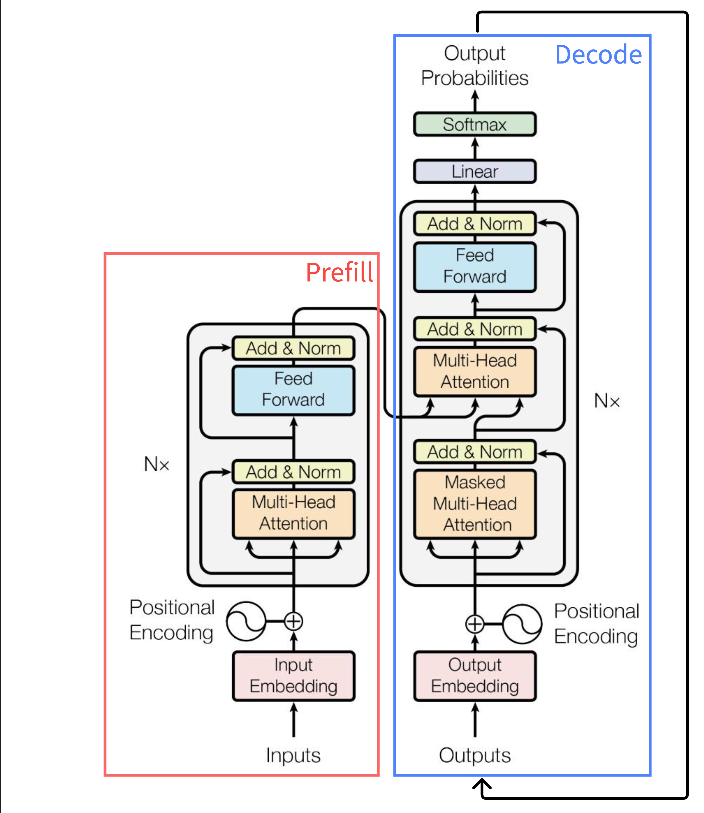
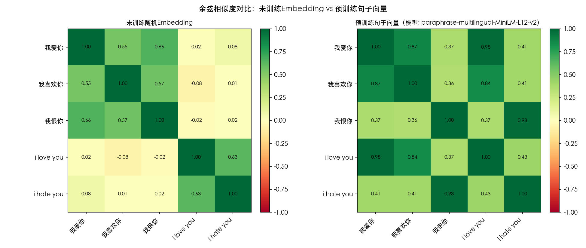
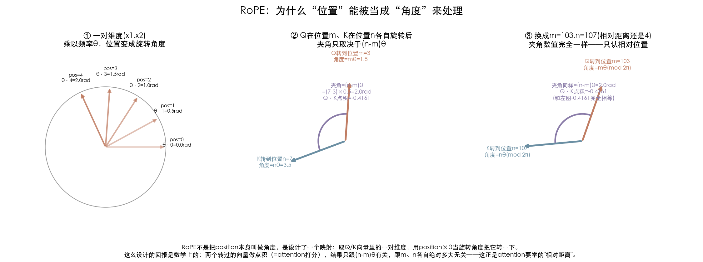
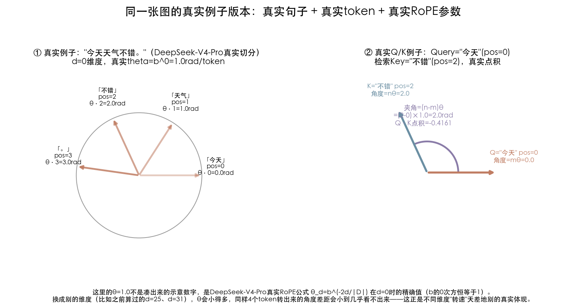
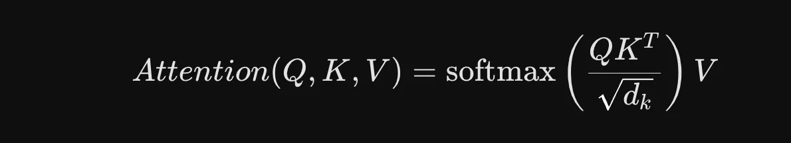
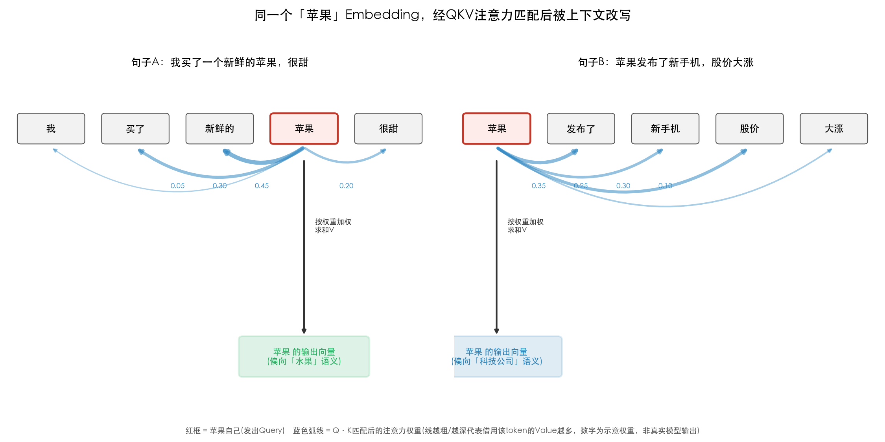
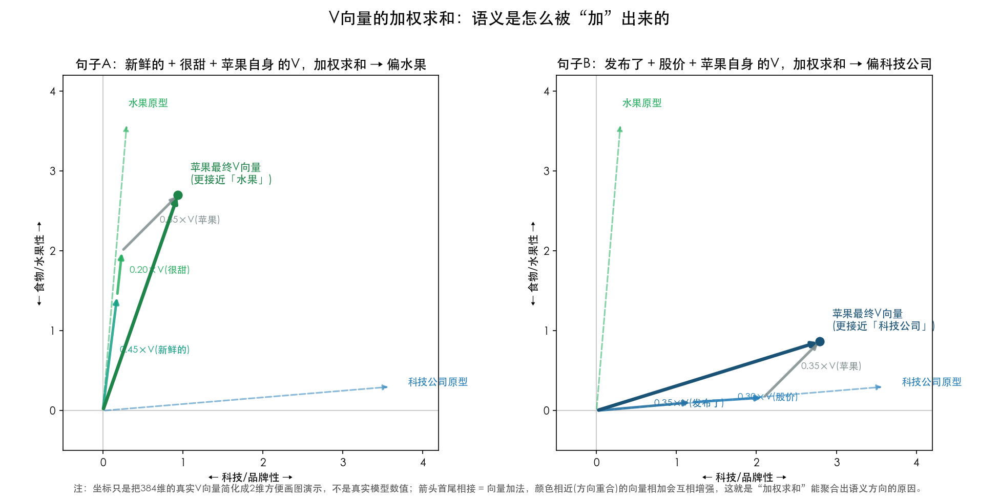
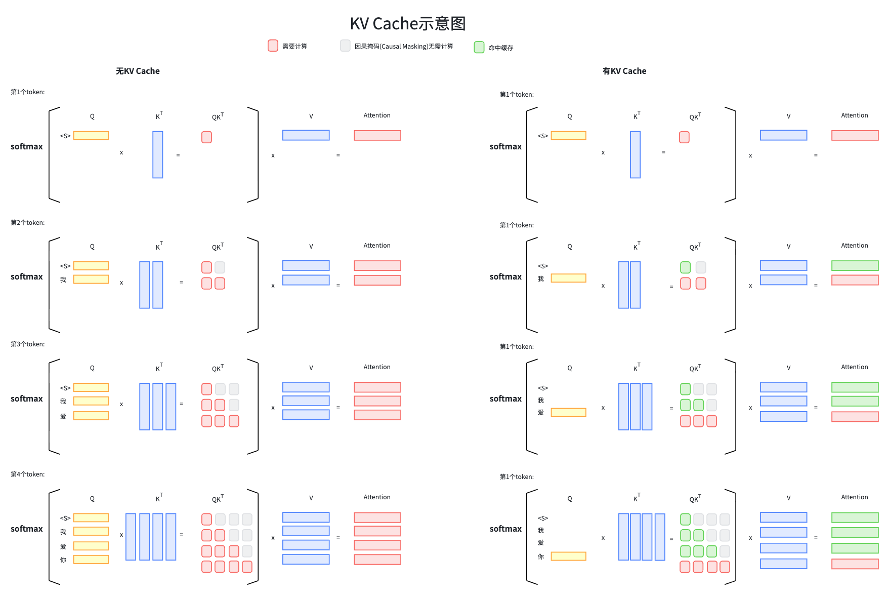
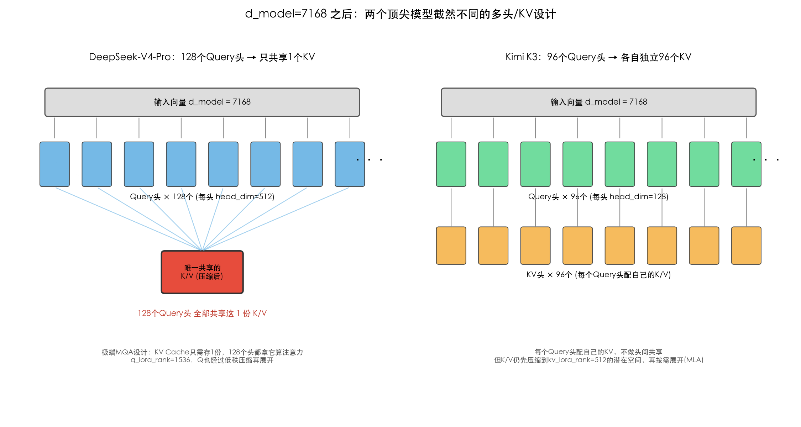
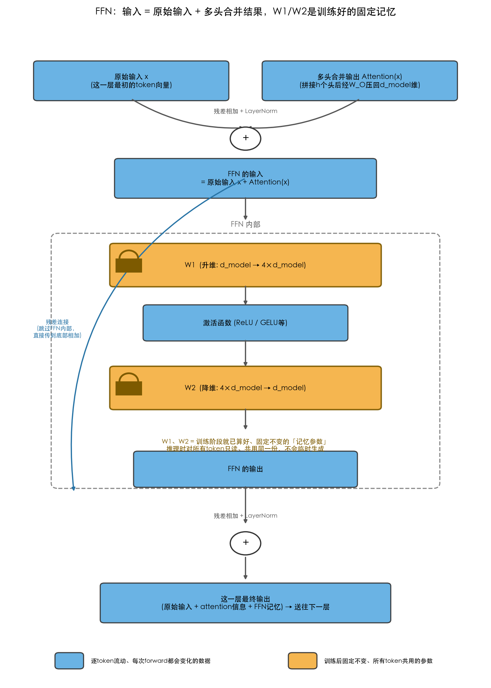

## 目录
- [1 Transformer-整体架构](#1-transformer-整体架构)
- [2 时间维度：Prefill 与 Decode](#2-时间维度prefill-与-decode)
- [3 单次前向流程：从Embedding到输出Token](#3-单次前向流程从embedding到输出token)
  - [3.1 Embedding](#31-embedding)
  - [3.2 位置编码](#32-位置编码)
  - [3.3 QKV矩阵](#33-qkv矩阵)
  - [3.4 Transformer如何实现的KV Cache](#34-transformer如何实现的kv-cache)
  - [3.5 多头机制](#35-多头机制)
  - [3.6 FFN](#36-ffn)
  - [3.7 多层机制](#37-多层机制)
  - [3.8 最终Linear + Softmax](#38-最终linear--softmax)
- [4 五大厂商大模型对比（2026年7月）](#4-五大厂商大模型对比2026年7月)

## 1 Transformer-整体架构

## 2 时间维度：Prefill 与 Decode

一次推理请求会经历两个特征完全不同的阶段：

| 维度 | Prefill（预填充） | Decode（解码）                                                                                             |
|---|---|------------------------------------------------------------------------------------------------------------|
| 处理对象 | 一次性处理完整输入context的所有token（system prompt、工具定义、历史对话、检索结果等都算在内，不只是用户单轮prompt） | 每次只生成1个新token，自回归、逐个进行                                                                     |
| 计算特征 | **计算密集型**：对整个context做大矩阵乘法（QKV投影、注意力、FFN），并行度高，GPU算力利用率高 | **存储密集型**：每步计算量很小（只算1个token），但要反复读写不断增长的KV Cache，瓶颈在显存带宽而非算力     |
| 关键产物 | 生成并缓存每个context token的K、V（即KV Cache），供后续decode复用 | 每步新增1个token的K、V追加进KV Cache；用当前token的Q查询全部历史K、V                                       |
| 延迟表现 | 首token延迟(TTFT)主要由prefill决定，**是输入context的总长度决定耗时** | 每个输出的token延迟主要由KV矩阵大小决定，输入context总长度决定KV矩阵大小，输入context越长单个token耗时越高 |

## 3 单次前向流程：从Embedding到输出Token

### 3.1 Embedding
把输入token映射成 d_model 维向量，叠加位置编码（如RoPE），得到每个token的初始表示。
映射成向量后同义词的token向量很相近，模型无需再关注所有语言的所有文字，而是只关心向量内部的具体含义。
需要注意的是，能把同义词映射为相近的向量是由与训练完成的，未经过预训练的向量函数无法完成这个功能。

### 3.2 位置编码

#### 为什么需要位置编码：Self-Attention本身"不看顺序"

Self-Attention机制本身是**置换不变**的——它只关心"这句话里出现了哪些token"，不关心"谁在前谁在后"。一个不需要Q/K概念就能看懂的例子："狗咬人"和"人咬狗"这两句话，如果不看顺序、只看"用到了哪些字"，两句话是完全一样的一堆token，如果没有位置信息，self-attention没有任何办法区分这两句话——含义却完全相反。

所以必须给每个token的表示叠加位置信息，让"内容相同、顺序不同"的句子在送进QKV投影之前就已经不一样了。这也是[3.1节Embedding](#31-embedding)里提到"叠加位置编码"这句话的原因：真正送进QKV矩阵计算的，不是纯粹的embedding，是embedding+位置编码的结果。位置编码具体怎么帮模型区分"同一个token在不同位置"这件事（比如同一句话里出现两次"苹果"），见[TransformerReplenish.md](TransformerReplenish.md)。

#### RoPE：把位置变成旋转角度

目前主流模型（GPT、Claude、DeepSeek这类）用的位置编码方案是**RoPE**（Rotary Position Embedding，旋转位置编码）。核心不是一个比喻，是真实的计算步骤：把Q、K向量切成一对对二维子向量，每一对乘上一个固定频率θ，用"位置×θ"当旋转角度，把这对子向量在二维平面里转一下。

之所以要设计成这样，是因为这样做之后有一个数学上的回报——两个转过的向量做点积（也就是attention打分），结果只取决于两者位置的差值(n-m)θ，跟各自的绝对位置无关：

上图右边两个面板做了一次可以自己验证的对比：面板②里Q在位置3、K在位置7（相对距离4），转完之后点积算出来是-0.4161；面板③把绝对位置整体平移到103和107（相对距离还是4），点积依然是-0.4161，分毫不差。这就是RoPE要的效果：**模型学到的不是"这个词在第几个字"，而是"这个词跟另一个词隔了多远"**。

换成一个真实例子看看是什么样子——句子"今天天气不错。"，用DeepSeek-V4-Pro官方tokenizer切出的4个真实token（今天/天气/不错/。，位置0~3），放到d=0这个真实维度上（真实RoPE参数b=10000, D=64，θ_0=b^0=1.0，精确值不是近似）：

左边能看到4个真实token各自转到的真实角度；右边挑了"今天"(pos=0)当Query、"不错"(pos=2)当Key，真实夹角=2.0rad，真实点积=-0.4161。RoPE不同维度的转速（频率θ）天差地别——这套"多个维度、不同转速一起编码位置"的机制，也是后面理解**Context Window上限从哪来**（[context-window/ContextWindow.md](../context-window/ContextWindow.md)）的基础：模型训练时能覆盖的位置范围，本质上就是这些旋转维度"见过的角度范围"。

> 延伸阅读：Q、K到底是"先各自旋转成向量、再做点积"，还是"先算出相对角度、再构造向量"？这个计算顺序容易搞反，[RoPE_ComputeOrder.md](RoPE_ComputeOrder.md)用数学证明+数值验证+真实开源代码（HuggingFace transformers）三层证据说清楚了真实顺序。

### 3.3 QKV矩阵
用三个独立的Linear矩阵（W_Q、W_K、W_V）对每个token的embedding做投影，得到Query、Key、Value三组向量。通过以下公式计算即可得到该token在此上下文含义当中的Value矩阵：

有个很经典的例子是token: 苹果，他的含义即有水果的意思，也有手机、公司的意思。下面我们来看下QKV矩阵如何匹配到这个词背后的含义。
先看两个句子：
- 句子A："我买了一个新鲜的苹果，很甜。"（水果义）
- 句子B："苹果发布了新款手机，股价大涨。"（品牌义）

在Embedding这一步（回顾上一步的理解），"苹果"这个token查表得到的初始向量，在A句和B句里是完全一样的——因为Embedding层只认token本身，不看上下文，它没办法区分这两个句子。这正是为什么必须要有下一步。
进入这一层，"苹果"和句子里其他每个token（"买"、"新鲜"、"甜" / "发布"、"手机"、"股价"）都各自算出自己的Q、K、V。关键的匹配过程是：

#### 1. "苹果"发出它的Query，相当于在问："这句话里，谁能帮我确定我到底是什么意思？"
#### 2. 句子里每个其他token亮出自己的Key，相当于在说："我这里有信息，你要不要参考我？"
#### 3. Q和K做点积打分，分数高低决定"苹果"该从谁那里借多少信息。

- 在句子A里，"新鲜"、"买"、"甜"这些token的Key，跟"苹果"的Query算出来的匹配分数会比较高（因为训练数据里"新鲜/甜/买"经常和"水果类"名词共现，模型学到了这种搭配模式）。
- 在句子B里，"发布"、"手机"、"股价"这些token的Key，跟"苹果"的Query匹配分数会更高（因为这类词经常和"科技公司"共现）。

#### 4. 匹配分数经Softmax归一化成权重后，"苹果"会按这个权重去加权聚合每个token的Value，最终取到平均值，得到的这个平均值就代表的苹果水果的含义，或者苹果品牌的含义。

> 延伸阅读：同一句话里出现两次同一个token（比如两次"苹果"分别指水果和公司）要怎么区分？见 [TransformerReplenish.md](TransformerReplenish.md)。

### 3.4 Transformer如何实现的KV Cache
第一层：Causal Masking（因果掩码）——不是为缓存设计的，但是缓存能成立的前提

我们之前讲自注意力时提到过"Q和所有K做点积"，但没细讲一个关键限制：decoder-only的Transformer（GPT、Claude、DeepSeek这类生成式模型）在做注意力时，会用一个"因果掩码"强制第i个token只能看第1到第i个token，绝对不能看到它后面的token。
这个设计原本是为了保证"自回归生成"本身逻辑自洽（生成第i个词的时候，当然不能偷看还没生成的第i+1个词）——但它带来一个意外但至关重要的副作用：一个token的K、V，永远只取决于它自己和它前面的token，跟它后面接了什么完全无关。
这意味着：如果两次请求的前N个token完全一样，不管这两次请求后面各自接了什么不同的内容，这前N个token算出来的K、V在数学上必然完全相同——这才是Prompt Caching能够成立的根本前提。
如果Transformer是双向的（比如BERT那种，每个token能看到整句话所有token），前缀的K、V就会随着后面接的内容不同而变化，"缓存前缀复用"这件事根本无从谈起。
所以严格说，这不是"为了缓存"专门做的优化，而是自回归生成本身的设计（因果掩码），恰好顺带让缓存变得可能。

### 3.5 多头机制：
把上一步拆成h个头并行计算（每个头有自己独立的W_Q/W_K/W_V子矩阵，投影到更低维子空间），让不同头分别关注不同类型的关系；h个头的输出拼接后，经一次Linear（W_O）压回d_model维—. 

注意头的拆分并不是token对应向量个数的拆分，而是每个token向量维度的拆分。
我们举例kimi K3模型，token输入个数是1M，d_model= 7168，拆成96个头
多头拆分后，qkv矩阵的个数还是1M，知识每个矩阵的维度从7168下降到了128（各头之间少部分重叠）
deepseek的设计思路还有所不同，只拆分了Query矩阵，KV矩阵未做拆分多头。

### 3.6 FFN：
合并后的向量经残差连接+LayerNorm，送入该层的FFN（两层Linear+非线性激活，先升维再降维）。
FFN是position-wise的：同一层内所有token位置共享同一套FFN参数，但**不同层之间的FFN参数各自独立、不共享**——这是模型参数量与"记忆"的主要载体。

### 3.7 多层机制：
多头注意力（含合并）+ FFN"构成一个block，重复N次。

层与层之间是**串行接力**：前一层输出直接作为下一层输入，不存在"多层结果最后汇总"，每层的注意力和FFN都用各自独立参数，逐层把表示提炼得更抽象。

### 3.8 最终Linear + Softmax：
堆叠完N层后，取最后一层的输出，经过整个模型**唯一一次**的LM head Linear，把d_model维投影到vocab_size维得到logits，再经**唯一一次**Softmax转成概率分布，最后采样/argmax选出新token。

## 4 五大厂商大模型对比（2026年7月）

对比国内 DeepSeek、智谱(GLM)、月之暗面(Kimi)，以及 OpenAI、Anthropic(Claude) 共5家的顶尖款与常用款模型。

> 这个行业价格和榜单变化非常快（几乎每周都有新模型/调价），下表是基于各家官方文档 + Artificial Analysis Intelligence Index 榜单核实的 2026年7月数据，**用之前建议去下方文档链接核对一次**，尤其是智谱的价格官网做了前端动态渲染，没能直接抓到拆分数字，用的是第三方交叉验证的估算值。

| 公司 | 档位 | 型号 | 上下文窗口 | 最大输出 | 输入价格($/百万token) | 输出价格($/百万token) | 性能评分¹ | API 文档 |
|---|---|---|---|---|---|---|---|---|
| **DeepSeek** | 顶尖款 | DeepSeek-V4-Pro | 1M | 384K | $0.435（缓存未命中）/ $0.0036（命中） | $0.87 | AA指数 44.3（V4 Pro Max档） | [api-docs.deepseek.com](https://api-docs.deepseek.com/quick_start/pricing) |
| **DeepSeek** | 常用款 | DeepSeek-V4-Flash | 1M | 384K | $0.14（未命中）/ $0.0028（命中） | $0.28 | 未单独收录，低于Pro档 | [api-docs.deepseek.com](https://api-docs.deepseek.com/quick_start/pricing) |
| **智谱 GLM** | 顶尖款 | GLM-5 | 200K | 128K | ≈$2.7（约¥20，官网未拆分，第三方估算） | ≈$3.2 | AA指数 51.1（GLM-5.2档） | [docs.bigmodel.cn](https://docs.bigmodel.cn/cn/guide/models/text/glm-5) |
| **智谱 GLM** | 常用款 | GLM-4.6 | 200K | 128K | ≈$0.7（约¥5，第三方数据，未在官网核实拆分） | 官网未拆分 | 略低于GLM-5，具体分未查到 | [docs.bigmodel.cn](https://docs.bigmodel.cn/cn/guide/models/text/glm-4.6) |
| **月之暗面 Kimi** | 顶尖款 | Kimi K3 | 1M（1,048,576） | 262K | $3.00（缓存未命中）/ $0.30（命中） | $15.00 | AA指数 57（对标 Opus 4.8 / GPT-5.5） | [platform.kimi.ai](https://platform.kimi.ai/docs/pricing/chat-v1) |
| **月之暗面 Kimi** | 常用款 | Kimi K2.6 | 262K | 262K | $0.95（未命中）/ $0.16（命中） | $4.00 | AA指数 44 | [platform.kimi.ai](https://platform.kimi.ai/docs/pricing/chat-v1) |
| **OpenAI** | 顶尖款 | GPT-5.6 Sol | 1M | — | $5.00 | $30.00 | AA指数 58.9 | [developers.openai.com](https://developers.openai.com/api/docs/pricing) |
| **OpenAI** | 常用款 | GPT-5.6 Luna（或更常见的 GPT-5-mini） | 1M / ~400K | — | $1.00 / $0.25 | $6.00 / $2.00 | 未单独查到，低于Sol档 | [developers.openai.com](https://developers.openai.com/api/docs/pricing) |
| **Anthropic Claude** | 顶尖款 | Claude Opus 4.8 | 1M | 128K | $5.00 | $25.00 | 官方未发布单一跑分；同系 Fable 5（更贵档）AA指数59.9 | [platform.claude.com](https://platform.claude.com/docs/en/about-claude/models/overview) |
| **Anthropic Claude** | 常用款 | Claude Sonnet 5 | 1M | 128K | $3.00（活动价$2，至2026-08-31） | $15.00（活动价$10） | 定位"近Opus质量，Sonnet成本" | [platform.claude.com](https://platform.claude.com/docs/en/about-claude/models/overview) |

¹ 性能评分统一采用 [Artificial Analysis Intelligence Index](https://artificialanalysis.ai)（综合推理/代码/知识类基准的加权指数，数值越高越强），是目前少数能跨厂商横向对比的第三方榜单之一，但**它不是唯一标准**——不同基准（LMArena Chat/Code Arena、SWE-bench、MMLU等）排名会有出入，具体到"哪个模型适合你的场景"建议结合具体任务实测。部分档位（如DeepSeek-V4-Flash、GLM-4.6、GPT-5.6 Luna、Claude Opus 4.8）没有查到该榜单的独立公开评分，已如实标注，不是漏填。

